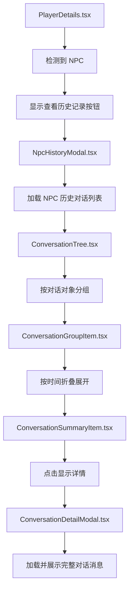
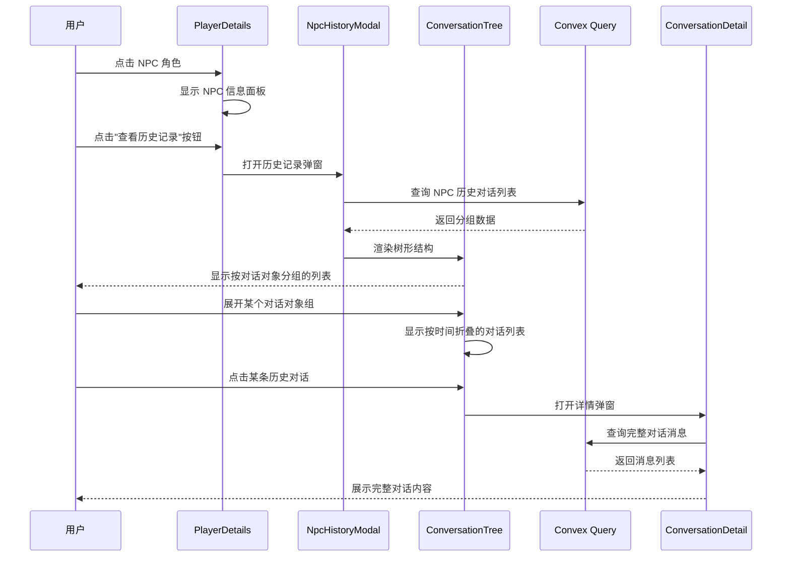
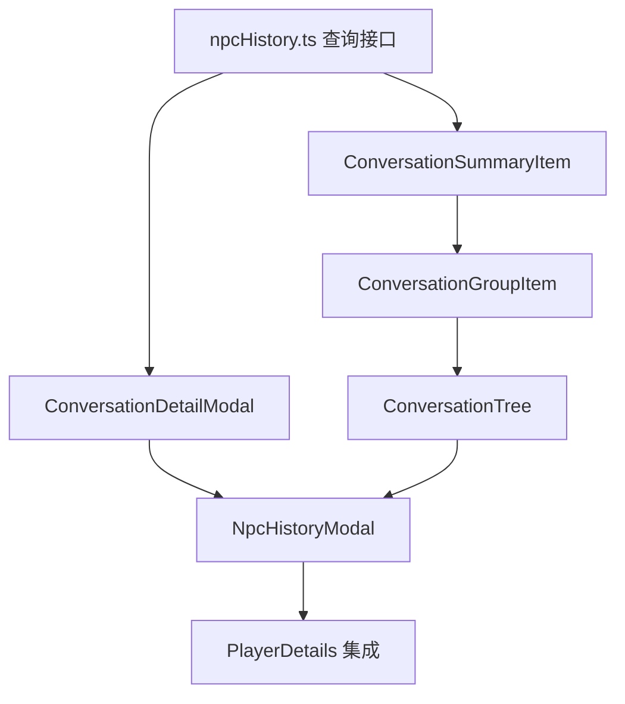

# NPC 对话历史记录功能改造方案

## 1. 现状分析

### 1.1 当前功能概述

当前项目中，NPC 对话框（[`NpcManageModal.tsx`](AstrTown/src/components/NpcManageModal.tsx:1)）主要用于管理 NPC 的创建、Token 查看和重置等操作。点击游戏界面中的 NPC 角色时，会通过 [`PlayerDetails.tsx`](AstrTown/src/components/PlayerDetails.tsx:1) 组件显示：
- NPC 的名称和人设描述
- 当前正在进行的对话内容（通过 [`Messages.tsx`](AstrTown/src/components/Messages.tsx:1) 组件）
- 上一条已结束的对话（通过 `previousConversation` 查询）

### 1.2 现有数据结构

#### 消息表（`messages`）
```typescript
messages: defineTable({
  conversationId,      // 对话 ID
  messageUuid: string, // 消息唯一标识
  author: playerId,    // 发送者 ID
  text: string,        // 消息内容
  worldId: optional(id('worlds')),
})
.index('conversationId', ['worldId', 'conversationId'])
.index('messageUuid', ['conversationId', 'messageUuid'])
```

#### 已归档对话表（`archivedConversations`）
```typescript
archivedConversations: defineTable({
  worldId: id('worlds'),
  id: conversationId,
  creator: playerId,
  created: number,
  ended: number,
  lastMessage: {...},
  numMessages: number,
  participants: array(playerId),
}).index('worldId', ['worldId', 'id'])
```

#### 对话参与关系表（`participatedTogether`）
```typescript
participatedTogether: defineTable({
  worldId: id('worlds'),
  conversationId,
  player1: playerId,
  player2: playerId,
  ended: number,
})
.index('edge', ['worldId', 'player1', 'player2', 'ended'])
.index('conversation', ['worldId', 'player1', 'conversationId'])
.index('playerHistory', ['worldId', 'player1', 'ended'])
```

#### Bot Token 表（`botTokens`）
```typescript
botTokens: defineTable({
  token: string,
  agentId: string,
  playerId: string,
  userId: optional(id('users')),
  worldId: id('worlds'),
  createdAt: number,
  expiresAt: number,
  isActive: boolean,
  ...
})
.index('agentId', ['worldId', 'agentId'])
.index('worldId', ['worldId'])
```

### 1.3 现有查询分析

当前 [`previousConversation`](AstrTown/convex/world.ts:230) 查询仅返回单条最近的历史对话：
```typescript
export const previousConversation = query({
  args: { worldId: v.id('worlds'), playerId },
  handler: async (ctx, args) => {
    const members = ctx.db
      .query('participatedTogether')
      .withIndex('playerHistory', (q) => 
        q.eq('worldId', args.worldId).eq('player1', args.playerId)
      )
      .order('desc');
    
    for await (const member of members) {
      const conversation = await ctx.db
        .query('archivedConversations')
        .withIndex('worldId', (q) => 
          q.eq('worldId', args.worldId).eq('id', member.conversationId)
        )
        .unique();
      if (conversation && conversation.numMessages > 0) {
        return conversation;
      }
    }
    return null;
  },
});
```

### 1.4 改造可行性结论

**当前数据结构完全支持存储历史对话**，因为：
1. 所有对话消息都存储在 `messages` 表中
2. 已结束的对话会被归档到 `archivedConversations` 表
3. `participatedTogether` 表记录了完整的对话参与关系

**需要新增的功能**：
1. 新增后端查询接口：按 NPC（agentId/playerId）获取所有历史对话
2. 新增前端组件：展示按对话对象和时间折叠的历史记录树
3. 在 PlayerDetails 组件中添加入口

---

## 2. 数据结构设计

### 2.1 后端查询返回结构

新增查询返回的数据结构：

```typescript
// NPC 历史对话记录
type NpcConversationHistory = {
  npcPlayerId: string;        // NPC 的 playerId
  npcName: string | null;     // NPC 名称
  conversations: GroupedConversations;  // 按对话对象分组的对话列表
};

// 按对话对象分组
type GroupedConversations = {
  [otherPlayerId: string]: ConversationGroup;
};

// 对话组
type ConversationGroup = {
  otherPlayerId: string;      // 对话者 ID
  otherPlayerName: string;    // 对话者名称
  isNpc: boolean;             // 对方是否也是 NPC
  conversations: ConversationSummary[];  // 该组的对话列表
};

// 对话摘要（按时间排序）
type ConversationSummary = {
  conversationId: string;
  created: number;            // 开始时间
  ended: number;              // 结束时间
  numMessages: number;        // 消息数量
  participants: string[];     // 参与者 ID 列表
  timeLabel: string;          // 时间标签（今天/昨天/本周/更早）
};

// 完整对话详情（点击展开时加载）
type ConversationDetail = {
  conversationId: string;
  created: number;
  ended: number;
  participants: string[];
  messages: MessageWithAuthor[];
};

// 带作者信息的消息
type MessageWithAuthor = {
  _id: string;
  _creationTime: number;
  conversationId: string;
  author: string;
  authorName: string;
  text: string;
  messageUuid: string;
};
```

### 2.2 索引设计建议

为支持高效查询，建议利用现有索引：

1. **按 NPC 查询参与过的对话**：使用 `participatedTogether` 表的 `conversation` 索引
   ```typescript
   .index('conversation', ['worldId', 'player1', 'conversationId'])
   ```

2. **按时间排序**：在查询时使用 `.order('desc')` 按 `_creationTime` 降序排列

---

## 3. 组件设计

### 3.1 组件架构图



### 3.2 新增组件清单

| 组件名 | 职责 | 预计行数 |
|--------|------|----------|
| `NpcHistoryModal.tsx` | NPC 历史记录弹窗主组件 | ~150 行 |
| `ConversationTree.tsx` | 树形结构渲染组件 | ~100 行 |
| `ConversationGroupItem.tsx` | 对话分组项（按对话对象） | ~80 行 |
| `ConversationSummaryItem.tsx` | 对话摘要项（按时间） | ~60 行 |
| `ConversationDetailModal.tsx` | 对话详情弹窗 | ~100 行 |

### 3.3 UI 交互流程



### 3.4 UI 设计风格

为保持与现有页面风格一致，新组件应遵循：

1. **配色方案**：使用现有的 `brown`、`slate`、`clay` 色系
2. **字体**：使用 `font-display` 标题字体和 `font-body` 正文字体
3. **边框**：使用 `border-slate-600/700` 和 `shadow-solid`
4. **交互**：折叠/展开使用 CSS 动画过渡
5. **响应式**：支持移动端和桌面端自适应

---

## 4. API 设计

### 4.1 新增查询接口

#### 4.1.1 获取 NPC 历史对话列表

```typescript
// convex/npcHistory.ts
export const getNpcConversationHistory = query({
  args: {
    worldId: v.id('worlds'),
    npcPlayerId: playerId,  // NPC 的 playerId
  },
  handler: async (ctx, args) => {
    // 1. 查询 NPC 参与的所有对话
    const conversations = await ctx.db
      .query('participatedTogether')
      .withIndex('conversation', (q) => 
        q.eq('worldId', args.worldId).eq('player1', args.npcPlayerId)
      )
      .order('desc')
      .collect();

    // 2. 获取 NPC 信息
    const npcDescription = await ctx.db
      .query('agentDescriptions')
      .withIndex('worldId', (q) => q.eq('worldId', args.worldId).eq('agentId', ...))
      .first();

    // 3. 按对话对象分组
    const grouped: Map<string, ConversationGroup> = new Map();
    
    for (const conv of conversations) {
      // 获取对话详情
      const convDoc = await ctx.db
        .query('archivedConversations')
        .withIndex('worldId', (q) => 
          q.eq('worldId', args.worldId).eq('id', conv.conversationId)
        )
        .unique();
      
      if (!convDoc) continue;

      // 确定对话对象（排除 NPC 自己）
      const otherPlayerIds = convDoc.participants.filter(id => id !== args.npcPlayerId);
      
      for (const otherId of otherPlayerIds) {
        // 按 otherPlayerId 分组
        // 按时间标签归类（今天/昨天/本周/更早）
      }
    }

    return { grouped, npcName: npcDescription?.name };
  },
});
```

#### 4.1.2 获取对话详情

```typescript
// convex/npcHistory.ts
export const getConversationDetail = query({
  args: {
    worldId: v.id('worlds'),
    conversationId: v.string(),
  },
  handler: async (ctx, args) => {
    // 1. 获取对话基本信息
    const conv = await ctx.db
      .query('archivedConversations')
      .withIndex('worldId', (q) => 
        q.eq('worldId', args.worldId).eq('id', args.conversationId)
      )
      .unique();

    if (!conv) return null;

    // 2. 获取所有消息
    const messages = await ctx.db
      .query('messages')
      .withIndex('conversationId', (q) => 
        q.eq('worldId', args.worldId).eq('conversationId', args.conversationId)
      )
      .collect();

    // 3. 获取消息作者名称
    const messagesWithAuthors = await Promise.all(
      messages.map(async (m) => {
        const authorDesc = await ctx.db
          .query('playerDescriptions')
          .withIndex('worldId', (q) => 
            q.eq('worldId', args.worldId).eq('playerId', m.author)
          )
          .unique();
        return { ...m, authorName: authorDesc?.name || 'Unknown' };
      })
    );

    return {
      ...conv,
      messages: messagesWithAuthors,
    };
  },
});
```

### 4.2 时间标签计算工具函数

```typescript
// utils/timeLabel.ts
export function getTimeLabel(timestamp: number): string {
  const now = Date.now();
  const diff = now - timestamp;
  const oneDay = 24 * 60 * 60 * 1000;
  
  const today = new Date(now);
  today.setHours(0, 0, 0, 0);
  
  const yesterday = new Date(today);
  yesterday.setDate(yesterday.getDate() - 1);
  
  const thisWeek = new Date(today);
  thisWeek.setDate(thisWeek.getDate() - 7);
  
  if (timestamp >= today.getTime()) {
    return '今天';
  } else if (timestamp >= yesterday.getTime()) {
    return '昨天';
  } else if (timestamp >= thisWeek.getTime()) {
    return '本周';
  } else {
    return '更早';
  }
}
```

---

## 5. 实现步骤建议

### 5.1 阶段一：后端查询接口

1. **创建 `convex/npcHistory.ts` 文件**
   - 实现 `getNpcConversationHistory` 查询
   - 实现 `getConversationDetail` 查询
   - 实现时间标签计算工具函数

2. **测试查询接口**
   - 验证返回数据结构正确
   - 验证按对话对象分组逻辑
   - 验证按时间折叠逻辑

### 5.2 阶段二：前端基础组件

3. **创建 `ConversationDetailModal.tsx`**
   - 展示完整对话消息
   - 复用现有 `Messages.tsx` 的消息展示样式
   - 添加关闭按钮

4. **创建 `ConversationSummaryItem.tsx`**
   - 显示对话摘要（时间、消息数、参与者）
   - 添加点击展开详情的交互

### 5.3 阶段三：树形结构组件

5. **创建 `ConversationGroupItem.tsx`**
   - 显示对话对象名称
   - 实现展开/收起该组的交互
   - 显示该组对话数量

6. **创建 `ConversationTree.tsx`**
   - 渲染所有分组的树形结构
   - 处理折叠/展开状态管理

### 5.4 阶段四：主弹窗组件

7. **创建 `NpcHistoryModal.tsx`**
   - 实现弹窗容器
   - 调用 `getNpcConversationHistory` 查询
   - 集成 `ConversationTree` 组件
   - 处理加载状态和错误状态

### 5.5 阶段五：集成到游戏界面

8. **修改 `PlayerDetails.tsx`**
   - 在检测到 NPC 时（`isExternalControlledNpc`），显示"查看历史记录"按钮
   - 按钮点击时打开 `NpcHistoryModal`
   - 保持与现有 UI 风格一致

9. **集成测试**
   - 测试从 NPC 面板打开历史记录
   - 测试查看不同 NPC 的历史记录
   - 测试查看不同对话对象的记录
   - 测试查看不同时间的对话详情

### 5.6 实现顺序依赖图



---

## 6. 技术难点与解决方案

### 6.1 难点一：大数据量性能优化

**问题**：当 NPC 有大量历史对话时，一次性加载可能导致性能问题。

**解决方案**：
1. 采用分页加载：首次只加载最近 N 条对话
2. 虚拟滚动：当列表很长时，仅渲染可见区域
3. 懒加载详情：仅在用户点击时才加载完整消息列表

### 6.2 难点二：按对话对象分组逻辑

**问题**：`participatedTogether` 表只记录两两对话关系，需要正确处理多人对话场景。

**解决方案**：
1. 遍历 `archivedConversations.participants` 数组
2. 排除 NPC 自己后，将对话归类到每个参与者组下
3. 同一对话可能在多个组中出现（符合预期）

### 6.3 难点三：时间标签的时区处理

**问题**：服务器存储的是 UTC 时间戳，用户可能在不同时区。

**解决方案**：
1. 前端使用 `new Date(timestamp).toLocaleDateString()` 自动适配时区
2. 或者统一使用服务器时区计算

### 6.4 难点四：与现有代码风格一致

**问题**：新组件需要与现有 UI 保持一致的视觉风格。

**解决方案**：
1. 复用 `modalStyles.ts` 中定义的样式
2. 参考 `NpcManageModal.tsx` 的布局结构
3. 使用 Tailwind 类名保持配色一致

---

## 7. 文件清单

### 7.1 新增文件

| 路径 | 说明 |
|------|------|
| `AstrTown/convex/npcHistory.ts` | 后端查询接口 |
| `AstrTown/src/components/NpcHistoryModal.tsx` | 历史记录主弹窗 |
| `AstrTown/src/components/ConversationTree.tsx` | 树形结构组件 |
| `AstrTown/src/components/ConversationGroupItem.tsx` | 对话分组项组件 |
| `AstrTown/src/components/ConversationSummaryItem.tsx` | 对话摘要项组件 |
| `AstrTown/src/components/ConversationDetailModal.tsx` | 对话详情弹窗 |
| `AstrTown/src/utils/timeLabel.ts` | 时间标签工具函数 |

### 7.2 修改文件

| 路径 | 修改内容 |
|------|----------|
| `AstrTown/src/components/PlayerDetails.tsx` | 添加"查看历史记录"按钮和弹窗逻辑 |

---

## 8. 总结

本改造方案基于现有代码结构进行分析，提出了完整的 NPC 对话历史记录功能实现方案：

### 8.1 方案要点

1. **数据结构兼容**：现有 `messages`、`archivedConversations`、`participatedTogether` 表已完全支持历史对话存储

2. **UI 入口位置**：在游戏界面的 [`PlayerDetails.tsx`](AstrTown/src/components/PlayerDetails.tsx:1) 组件中，当检测到 NPC 时显示"查看历史记录"按钮

3. **展示方式**：
   - 第一层：按对话对象分组（显示与谁对话）
   - 第二层：按时间折叠（今天/昨天/本周/更早）
   - 第三层：点击显示完整对话详情

4. **权限设计**：所有用户可以查看 NPC 的所有历史对话（无权限限制）

5. **技术栈**：
   - 后端：Convex Query
   - 前端：React + TypeScript + Tailwind CSS
   - 状态管理：React 本地状态

### 8.2 实现建议

- 建议按"后端 → 基础组件 → 树形组件 → 主弹窗 → 集成"的顺序逐步实现
- 每个阶段完成后进行充分测试
- 保持与现有代码风格一致，复用已有的样式和组件

### 8.3 后续可扩展方向

1. 添加搜索功能：按关键词搜索历史对话
2. 添加筛选功能：按时间范围、对话对象筛选
3. 添加导出功能：导出对话记录为文本文件
4. 添加统计功能：显示 NPC 对话频次统计图表
