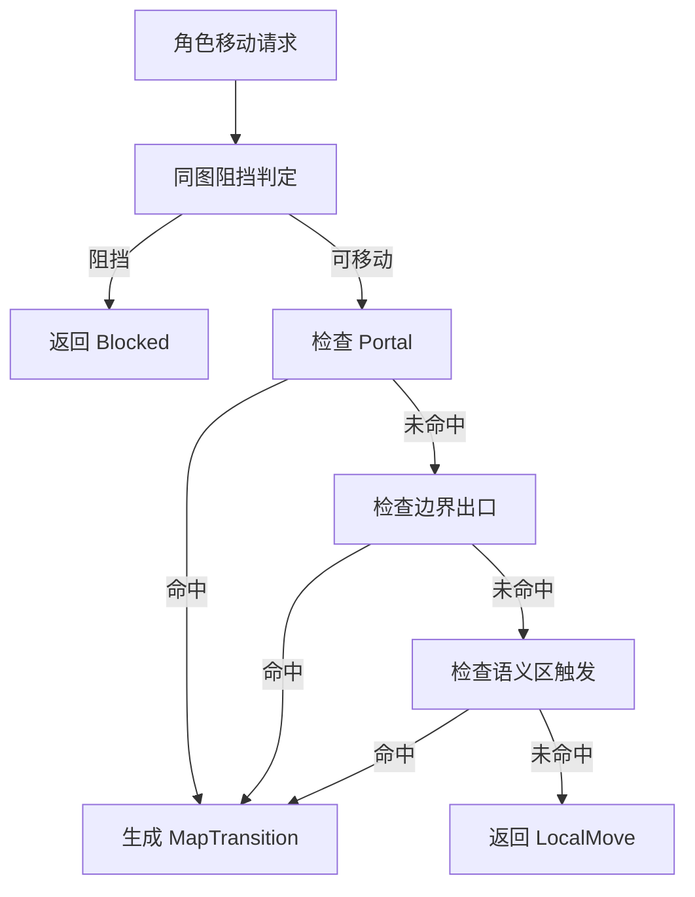

# 第三阶段：多地图支持 - 执行方案

## 1. 概述

- 目标
  - 在保留 [`world`](../AstrTown/convex/world.ts) 作为社交、会话、引擎生命周期容器的前提下，将运行时从单地图模型扩展为 world 内多地图模型。
  - 为外部 AI AGENT BOT 控制角色建立稳定的跨地图位置表达能力，即 `player.mapId + x + y`。
  - 在后端补齐地图集合加载、地图连接、跨地图移动判定与事件分发；在前端补齐地图切换渲染、同图可见性与导航 UI。
- 范围
  - 后端数据模型：[`AstrTown/convex/aiTown/player.ts`](../AstrTown/convex/aiTown/player.ts)、[`AstrTown/convex/aiTown/worldMap.ts`](../AstrTown/convex/aiTown/worldMap.ts)、[`AstrTown/convex/aiTown/schema.ts`](../AstrTown/convex/aiTown/schema.ts)
  - 后端运行时：[`AstrTown/convex/aiTown/game.ts`](../AstrTown/convex/aiTown/game.ts)、[`AstrTown/convex/aiTown/movement.ts`](../AstrTown/convex/aiTown/movement.ts)、[`AstrTown/convex/world.ts`](../AstrTown/convex/world.ts)、[`AstrTown/convex/init.ts`](../AstrTown/convex/init.ts)
  - 前端加载与渲染：[`AstrTown/src/hooks/serverGame.ts`](../AstrTown/src/hooks/serverGame.ts)、[`AstrTown/src/components/Game.tsx`](../AstrTown/src/components/Game.tsx)、[`AstrTown/src/components/PixiGame.tsx`](../AstrTown/src/components/PixiGame.tsx)、[`AstrTown/src/components/PixiStaticMap.tsx`](../AstrTown/src/components/PixiStaticMap.tsx)
  - 可选配套：编辑器数据读写兼容层，优先做到读取已有连接配置，完整可视化编辑能力后置。
- 前置条件
  - 已完成当前单地图实现的结构调研，并确认 [`serializedPlayer`](../AstrTown/convex/aiTown/player.ts:49) 尚未表达地图归属、[`Game.worldMap`](../AstrTown/convex/aiTown/game.ts:156) 仍为单实例、[`gameDescriptions`](../AstrTown/convex/world.ts:206) 仍只返回单张地图。
  - 默认 world 初始化链路已稳定，允许在 [`AstrTown/convex/init.ts`](../AstrTown/convex/init.ts) 上追加 mapId 生成与数据迁移逻辑。
  - 本项目角色统一视为外部 AI AGENT BOT 控制对象，不区分传统意义的人类玩家与 NPC，因此本方案中的 player 变更默认作用于全部角色。

## 2. 数据模型变更设计

### 2.1 Player 结构变更

#### 目标
为角色位置建立稳定的地图维度，使任意时刻位置表达从二维点升级为三元组：`mapId + x + y`。

#### 现状约束
- [`serializedPlayer`](../AstrTown/convex/aiTown/player.ts:49) 仅有 `position`、`facing`、`speed`，无地图标识。
- [`playerLocation()`](../AstrTown/convex/aiTown/location.ts:24) 只压缩 `x/y/dx/dy/speed`，历史位置系统默认单地图上下文。
- [`PixiGame`](../AstrTown/src/components/PixiGame.tsx:82) 默认取 `props.game.worldMap` 的尺寸与 tileDim，对所有玩家统一渲染。

#### 设计方案
- 在 [`serializedPlayer`](../AstrTown/convex/aiTown/player.ts:49) 中新增：
  - `mapId: v.string()`：角色当前所在地图的稳定业务 ID。
- 在 [`Player`](../AstrTown/convex/aiTown/player.ts:64) 类中新增：
  - `mapId: string`
- 历史位置系统分两层处理：
  - 运动连续性仍保留 [`location.ts`](../AstrTown/convex/aiTown/location.ts) 现有数值压缩结构。
  - 地图切换不作为连续插值的一部分，而是作为离散事件记录到新事件流或玩家状态 diff 中。
- 对路径规划态 `pathfinding` 增加约束：
  - 当前阶段仍保持单地图内寻路。
  - 跨地图时将目标拆解为阶段性目标，当前路径仅属于玩家所在地图。

#### 迁移策略
1. 为现有 `maps` 表中的默认地图生成稳定 `mapId`，例如 `main` 或基于初始化配置推导。
2. 为现有 world 中全部 players 回填 `mapId = 默认地图 mapId`。
3. 若运行时加载到旧数据且角色无 `mapId`，在构造 [`Player`](../AstrTown/convex/aiTown/player.ts:64) 或加载 [`Game`](../AstrTown/convex/aiTown/game.ts:145) 时做一次兼容兜底，但仅作为过渡，不作为长期依赖。
4. 所有新建角色在 join 或初始化阶段直接写入 `mapId`。

### 2.2 WorldMap 结构变更

#### 目标
使地图对象既能承载静态 tile 数据，也能表达跨地图连接、出生点、语义触发区等业务元数据。

#### 现状约束
- [`serializedWorldMap`](../AstrTown/convex/aiTown/worldMap.ts:18) 仅描述渲染层字段：尺寸、tiles、动画精灵。
- [`WorldMap`](../AstrTown/convex/aiTown/worldMap.ts:35) 未表达稳定 ID、名称、连接、触发器。

#### 设计方案
在 [`serializedWorldMap`](../AstrTown/convex/aiTown/worldMap.ts:18) 中新增以下业务字段：

- 基础元数据
  - `mapId: v.string()`：稳定业务 ID，作为跨表引用主键。
  - `mapName: v.string()`：展示名称。
  - `order: v.optional(v.number())`：world 内排序。
  - `isPrimary: v.optional(v.boolean())`：是否主视图默认地图。

- 出生与落点
  - `spawnPoints: v.array(v.object({ key: v.string(), x: v.number(), y: v.number(), facingDx: v.number(), facingDy: v.number() }))`
  - 用于 join、portal 目标点、边界连接目标点复用。

- Portal 定义
  - `portals: v.array(v.object({ portalId: v.string(), from: v.object({ x: v.number(), y: v.number() }), toMapId: v.string(), toSpawnKey: v.string(), trigger: v.union(v.literal('step'), v.literal('interact')), enabled: v.boolean() }))`

- 边界出口定义
  - `connections: v.array(v.object({ connectionId: v.string(), edge: v.union(v.literal('left'), v.literal('right'), v.literal('top'), v.literal('bottom')), rangeStart: v.number(), rangeEnd: v.number(), toMapId: v.string(), toSpawnKey: v.string(), mode: v.literal('boundaryExit'), enabled: v.boolean() }))`

- 语义区触发定义
  - `semanticTransitions: v.array(v.object({ transitionId: v.string(), semanticRegionKey: v.string(), toMapId: v.string(), toSpawnKey: v.string(), conditionKind: v.union(v.literal('enterRegion'), v.literal('stayRegion'), v.literal('intent')), enabled: v.boolean() }))`

#### 设计原则
- 连接定义优先放入 map 文档本身，避免单独再建复杂连接表，保持现有 `maps` 分表风格。
- 目标地图使用 `toMapId` 业务 ID，而不是 Convex 文档 `_id`，避免环境迁移导致连接失效。
- 渲染字段与业务字段并存，但运行时应拆成：
  - 静态渲染数据
  - 连接与导航元数据
  - 触发器元数据

### 2.3 maps 表变更

#### 现状约束
- [`maps`](../AstrTown/convex/aiTown/schema.ts:30) 当前只有 `worldId + serializedWorldMap`，且只建了 [`worldId`](../AstrTown/convex/aiTown/schema.ts:33) 索引。
- [`Game.load()`](../AstrTown/convex/aiTown/game.ts:189) 与 [`gameDescriptions()`](../AstrTown/convex/world.ts:206) 都按 `worldId` 查单条地图。

#### 表结构建议
- 在 [`AstrTown/convex/aiTown/schema.ts`](../AstrTown/convex/aiTown/schema.ts) 中将 `maps` 扩展为多文档集合，新增索引：
  - `index('worldId_mapId', ['worldId', 'mapId'])`
  - `index('worldId_order', ['worldId', 'order'])`
  - 视需要增加 `index('worldId_isPrimary', ['worldId', 'isPrimary'])`

#### 迁移策略
- 保留 `worldId` 维度不变，world 仍是地图集合容器。
- 将当前单地图文档原地补充 `mapId/mapName/isPrimary/order/spawnPoints` 等字段。
- 后续新增地图时，统一通过 worldId + mapId 写入，不改动 world 主文档结构。

#### 推荐最小侵入式切入点
- 不把地图集合塞回 [`worlds`](../AstrTown/convex/aiTown/schema.ts:16) 主文档，继续沿用分表方式。
- 先改查询与运行时装载逻辑，让 [`Game`](../AstrTown/convex/aiTown/game.ts) 接收 `worldMaps[]` 或 `Map<string, WorldMap>`，再逐步替换所有单图引用。

## 3. 地图连接机制设计

### 3.1 Portal Tile

#### 使用场景
- 室内外门口
- 传送阵
- 明确的地块入口

#### 数据定义
- 由 [`WorldMap.portals`](../AstrTown/convex/aiTown/worldMap.ts:18) 表达。
- 每个 portal 明确源瓦片、目标地图、目标落点、触发方式。

#### 运行时判定
1. 玩家完成一次移动步进后，读取玩家当前 `mapId` 对应地图。
2. 检查目标 tile 是否命中 portal `from`。
3. 若命中且 `enabled=true`：
   - 清空当前 `pathfinding`
   - 触发跨地图迁移
   - 将玩家位置重设为目标地图指定 `spawnPoint`
   - 记录地图切换事件

#### 技术要点
- Portal 判定优先级高于语义区触发，低于阻挡判定。
- Portal 目标落点必须是可通行 tile，初始化和保存配置时做一致性校验。
- Portal 支持 `step` 与 `interact` 两种触发方式，第一阶段建议先实现 `step`。

### 3.2 边界出口

#### 使用场景
- 大地图分块
- 相邻区域无缝拼接
- 同主题区域的横向或纵向延展

#### 数据定义
- 由 [`WorldMap.connections`](../AstrTown/convex/aiTown/worldMap.ts:18) 表达。
- 每条连接定义边、边界范围、目标地图和落点。

#### 运行时判定
1. 在 [`blocked()`](../AstrTown/convex/aiTown/movement.ts) 附近将越界逻辑从单纯拒绝移动改为两段式：
   - 先检查是否存在匹配边界出口
   - 若无匹配连接则仍视为阻挡
2. 若有匹配：
   - 允许本次移动产生“跨地图结果”而非普通坐标更新
   - 执行地图切换并把角色放到目标地图对应入口点

#### 技术要点
- 边界连接必须是显式配置，避免所有出界都自动切图。
- 推荐目标落点由 `spawnKey` 管理，而不是把边界坐标直接硬编码到连接上，便于后续地图重排。
- 可选增强：支持双向自动补全，但持久化仍存为两条显式连接，降低运行时推理复杂度。

### 3.3 语义区触发

#### 使用场景
- 基于 [`worldSemantic`](../AstrTown/convex/aiTown/schema.ts:49) 的车站、码头、楼梯口等抽象区域
- AI AGENT BOT 通过语义理解进入下一张地图

#### 数据定义
- `semanticTransitions` 只存语义区 key 与跳转目标，不重复存 tile 区域。
- 具体区域边界继续由 `worldSemantic` 维护。

#### 运行时判定
1. 角色移动完成或意图执行前，根据 `player.mapId + position` 查询当前地图所属语义区。
2. 若命中配置的 `semanticRegionKey` 且满足条件，则触发地图迁移。
3. 事件层可同时广播 `semantic.transitionTriggered` 和 `player.mapChanged`。

#### 技术要点
- 语义区触发更适合 AI 控制角色，而非纯点击移动输入。
- 第一阶段建议仅实现 `enterRegion`，避免停留触发导致频繁切图。
- 语义区数据必须具备地图维度，否则相同 region key 在多地图下会歧义；应扩展 worldSemantic 实例使其带上 `mapId`。

### 3.4 三种触发机制的统一抽象

建议新增统一结果类型：
- `MoveResolution = Blocked | LocalMove | MapTransition`

其中 `MapTransition` 至少包含：
- `fromMapId`
- `toMapId`
- `toPosition`
- `reason: portal | boundaryExit | semanticTransition`
- `connectionId or portalId or transitionId`

这样可让 [`movement.ts`](../AstrTown/convex/aiTown/movement.ts)、[`game.ts`](../AstrTown/convex/aiTown/game.ts)、事件分发与前端动画共享同一抽象。

## 4. API 设计

### 4.1 地图查询相关

#### 查询 world 下的地图列表
- 建议新增到 [`AstrTown/convex/world.ts`](../AstrTown/convex/world.ts)
- 名称建议：`worldMaps`
- 输入：
  - `worldId: Id<'worlds'>`
- 输出：
  - `maps: Array<{ mapId, mapName, order, isPrimary, width, height, connectionSummary, spawnPointsSummary }>`
- 用途：
  - 前端地图导航 UI
  - 调试面板
  - 编辑器读取

#### 获取地图详情 含连接信息
- 名称建议：`worldMapDetail`
- 输入：
  - `worldId`
  - `mapId`
- 输出：
  - 完整 [`WorldMap`](../AstrTown/convex/aiTown/worldMap.ts) 序列化对象
  - 可附带 `connectedMaps` 轻量摘要
- 用途：
  - 地图切换后按需加载
  - 编辑器或调试视图查看连接

#### 调整现有游戏描述查询
- 将 [`gameDescriptions()`](../AstrTown/convex/world.ts:206) 改造为返回：
  - `worldMaps`
  - `primaryMapId`
  - `playerDescriptions`
- 或保留旧接口并新增 `gameMapBundle()`；推荐新增新接口，避免一次性破坏现有调用方。

### 4.2 玩家移动相关

#### 玩家跨地图移动 mutation
- 建议位置：[`AstrTown/convex/world.ts`](../AstrTown/convex/world.ts) 或 [`AstrTown/convex/aiTown`](../AstrTown/convex/aiTown) 下新文件
- 名称建议：`movePlayerAcrossMaps` 或在现有 `moveTo` 输入执行链中内聚实现
- 输入：
  - `playerId`
  - `destination` 或 `intent`
- 输出：
  - `result: blocked | moved | transitioned`
  - 若为 `transitioned`，返回 `fromMapId/toMapId/reason/spawnKey`

#### 推荐实现方式
- 不新增独立的“跨地图移动专用 mutation”作为外部入口。
- 继续沿用现有移动输入链路，只在引擎内部把结果扩展成 `MapTransition`。
- 对外部 AI AGENT BOT 而言，移动行为仍是统一动作，避免上层协议分叉。

### 4.3 地图切换事件

#### 事件模型
建议新增事件载荷：
- `player.mapChanged`
  - `worldId`
  - `playerId`
  - `fromMapId`
  - `toMapId`
  - `fromPosition`
  - `toPosition`
  - `reason`
  - `connectionRef`

#### 处理链路
- 触发源：[`movement.ts`](../AstrTown/convex/aiTown/movement.ts) 返回 `MapTransition`
- 应用层：[`Game`](../AstrTown/convex/aiTown/game.ts) 更新玩家状态与历史记录
- 分发层：
  - Convex 查询订阅自动把新状态推到前端
  - 如 gateway 需要感知，可在 world event 分发器中追加 mapChanged 事件转发

#### 兼容策略
- 保留现有位置更新事件语义。
- 新增地图切换事件，不复用普通 move 事件，避免下游误判为同图位移。

## 5. 任务清单

| 任务ID | 任务名称 | 优先级 | 依赖 | 预估复杂度 |
|--------|----------|--------|------|------------|
| L.1 | 设计并落地多地图数据模型与迁移基线 | 高 | 无 | 高 |
| L.2 | 将 Game 运行时从单 worldMap 改为地图集合模型 | 高 | L.1 | 高 |
| L.3 | 重构移动解析为同图移动与跨地图切换统一结果 | 高 | L.2 | 高 |
| L.4 | 实现 Portal Tile 触发机制 | 高 | L.3 | 中 |
| L.5 | 实现边界出口连接机制 | 高 | L.3 | 中 |
| L.6 | 实现语义区地图切换机制 | 中 | L.1, L.3 | 高 |
| L.7 | 扩展地图查询 API 与地图详情 API | 高 | L.1, L.2 | 中 |
| L.8 | 前端支持多地图加载、当前视图地图与同图可见性 | 高 | L.2, L.7 | 高 |
| L.9 | 前端补充地图切换过渡、导航 UI 与状态同步 | 中 | L.8 | 中 |
| L.10 | 地图编辑器与初始化链路支持 mapId 和连接配置 | 中 | L.1, L.4, L.5, L.6 | 高 |

## 6. 详细任务说明

### 任务 L.1：设计并落地多地图数据模型与迁移基线

**目标**：
- 给 `maps` 建立稳定 `mapId`
- 给全部角色增加 `mapId`
- 为地图补齐连接、出生点、业务名称等字段
- 为旧世界数据提供平滑迁移路径

**修改文件**：
- [`AstrTown/convex/aiTown/player.ts`](../AstrTown/convex/aiTown/player.ts) - 给 [`serializedPlayer`](../AstrTown/convex/aiTown/player.ts:49) 与 [`Player`](../AstrTown/convex/aiTown/player.ts:64) 添加 `mapId`
- [`AstrTown/convex/aiTown/worldMap.ts`](../AstrTown/convex/aiTown/worldMap.ts) - 扩展 `mapId/mapName/spawnPoints/portals/connections/semanticTransitions`
- [`AstrTown/convex/aiTown/schema.ts`](../AstrTown/convex/aiTown/schema.ts) - 扩展 `maps` 表索引
- [`AstrTown/convex/init.ts`](../AstrTown/convex/init.ts) - 默认 world 与默认 map 迁移、回填
- 可选新增 [`AstrTown/convex/aiTown/mapConfig.ts`](../AstrTown/convex/aiTown/mapConfig.ts) - 抽离连接与 spawn 类型定义

**实施步骤**：
1. 在 [`serializedPlayer`](../AstrTown/convex/aiTown/player.ts:49) 中增加 `mapId` 字段，并同步更新构造函数与 `serialize()`。
2. 在 [`serializedWorldMap`](../AstrTown/convex/aiTown/worldMap.ts:18) 增加业务字段，确保 `serialize()` 对称。
3. 在 [`aiTownTables.maps`](../AstrTown/convex/aiTown/schema.ts:30) 增加复合索引，支持按 `worldId + mapId` 查询。
4. 在 [`AstrTown/convex/init.ts`](../AstrTown/convex/init.ts) 初始化地图时写入默认 `mapId`、`mapName`、`spawnPoints`。
5. 在初始化或单独 migration 中遍历 world 的 players，统一回填 `mapId` 到默认地图。
6. 为 portal、connection、spawnPoint 的目标落点添加静态校验函数，初始化阶段提前报错。

**技术要点**：
- `mapId` 必须是业务稳定键，不能依赖 Convex `_id`。
- migration 要具备幂等性，重复运行不破坏既有数据。
- 所有连接配置都应引用 `spawnKey`，减少坐标硬编码。

**验收标准**：
- [ ] 新建与旧有 world 中的每个 player 都具备 `mapId`
- [ ] `maps` 表可在同一 world 下存多条 map 文档
- [ ] 每张 map 至少有一个默认 spawnPoint
- [ ] 旧单地图 world 在不改动上层逻辑时仍能成功加载

### 任务 L.2：将 Game 运行时从单 worldMap 改为地图集合模型

**目标**：
- 把 [`Game.worldMap`](../AstrTown/convex/aiTown/game.ts:156) 改造成地图集合与当前视图地图解耦结构
- 为后续移动和前端渲染提供 `mapId -> WorldMap` 查询能力

**修改文件**：
- [`AstrTown/convex/aiTown/game.ts`](../AstrTown/convex/aiTown/game.ts) - 将单一 `worldMap` 改为 `worldMaps` 与 `primaryMapId/currentMapId`
- [`AstrTown/convex/world.ts`](../AstrTown/convex/world.ts) - 调整查询返回多地图
- [`AstrTown/src/hooks/serverGame.ts`](../AstrTown/src/hooks/serverGame.ts) - 解析多地图 bundle
- 可选新增 [`AstrTown/convex/aiTown/gameMapIndex.ts`](../AstrTown/convex/aiTown/gameMapIndex.ts) - 统一 map 查找辅助

**实施步骤**：
1. 修改 [`GameState`](../AstrTown/convex/aiTown/game.ts) 类型，使其从 `worldMap` 单对象改为 `worldMaps` 数组。
2. 在 [`Game.load()`](../AstrTown/convex/aiTown/game.ts:168) 中把 [`maps`](../AstrTown/convex/aiTown/schema.ts:30) 查询从 `unique/first` 改为 `collect`。
3. 在 [`Game`](../AstrTown/convex/aiTown/game.ts:145) 构造中构建 `Map<string, WorldMap>` 索引。
4. 提供辅助方法：`getMap(mapId)`、`getPrimaryMap()`、`getPlayerMap(playerId)`。
5. 在 [`useServerGame()`](../AstrTown/src/hooks/serverGame.ts:19) 中把后端返回的多地图数组解析为前端可直接索引的数据结构。
6. 为兼容旧前端，可在过渡期保留 `currentWorldMap` 只读派生字段。

**技术要点**：
- 当前视图地图不应直接绑定世界主地图，而应由角色视角或 UI 状态决定。
- Game 内部地图集合建议使用 `Map<string, WorldMap>`，避免频繁线性搜索。

**验收标准**：
- [ ] 游戏运行时可同时装载同一 world 下多张地图
- [ ] 任一 player 可基于 `mapId` 解析所在地图
- [ ] 旧逻辑在主地图场景下仍可渲染

### 任务 L.3：重构移动解析为同图移动与跨地图切换统一结果

**目标**：
- 把当前单纯的 tile 阻挡与路由逻辑升级为统一移动解析层
- 允许移动系统返回 `MapTransition`

**修改文件**：
- [`AstrTown/convex/aiTown/movement.ts`](../AstrTown/convex/aiTown/movement.ts) - 扩展 `blocked/findRoute` 语义
- [`AstrTown/convex/aiTown/game.ts`](../AstrTown/convex/aiTown/game.ts) - 应用移动结果
- 可选新增 [`AstrTown/convex/aiTown/mapTransition.ts`](../AstrTown/convex/aiTown/mapTransition.ts) - 定义 `MoveResolution`

**实施步骤**：
1. 提炼当前移动判定流程，新增 `resolveMovement()` 统一返回类型。
2. 将 [`blocked()`](../AstrTown/convex/aiTown/movement.ts) 改造成接收 `WorldMap + player.mapId + targetTile`。
3. 当目标越界或命中特殊触发点时，不直接视为 blocked，而是进入连接解析分支。
4. 在 [`Game`](../AstrTown/convex/aiTown/game.ts) 中根据 `MoveResolution` 分别处理：
   - `Blocked`
   - `LocalMove`
   - `MapTransition`
5. 地图切换后清理旧路径、重设面向方向与落点。

**技术要点**：
- 路径搜索范围必须限定在玩家当前地图。
- 跨地图切换不做跨图全局 A*，避免复杂度陡增；只做单次边界或 portal 跳转。

**验收标准**：
- [ ] 单图移动行为与现状一致
- [ ] 移动系统可显式返回地图切换结果
- [ ] 地图切换后玩家不保留失效路径

### 任务 L.4：实现 Portal Tile 触发机制

**目标**：
- 支持通过特定 tile 执行稳定跨地图跳转

**修改文件**：
- [`AstrTown/convex/aiTown/worldMap.ts`](../AstrTown/convex/aiTown/worldMap.ts) - 增加 `portals`
- [`AstrTown/convex/aiTown/movement.ts`](../AstrTown/convex/aiTown/movement.ts) - 增加 portal 判定
- [`AstrTown/convex/init.ts`](../AstrTown/convex/init.ts) 或地图配置文件 - 写入示例 portal

**实施步骤**：
1. 为地图定义 portal 数据结构并完成序列化。
2. 在移动落点判定后查找命中的 portal。
3. 构造 `MapTransition` 并交给 [`Game`](../AstrTown/convex/aiTown/game.ts) 应用。
4. 写入至少一组双向 portal 作为验收样例。

**技术要点**：
- Portal 要求双向关系显式配置，不依赖自动反推。
- 目标 spawn 必须校验可达且不阻挡。

**验收标准**：
- [ ] 角色进入指定 portal tile 后切换到目标地图
- [ ] 双向 portal 往返位置正确
- [ ] 目标点异常时系统给出明确错误

### 任务 L.5：实现边界出口连接机制

**目标**：
- 允许角色在指定边界范围走出地图并进入相邻地图

**修改文件**：
- [`AstrTown/convex/aiTown/worldMap.ts`](../AstrTown/convex/aiTown/worldMap.ts) - 增加 `connections`
- [`AstrTown/convex/aiTown/movement.ts`](../AstrTown/convex/aiTown/movement.ts) - 改造越界判定

**实施步骤**：
1. 为每个边界连接定义 edge、range、目标地图与 spawnKey。
2. 在越界判定时先匹配连接，再决定是否 blocked。
3. 对目标地图落点做边界和阻挡校验。
4. 为相邻地图建立左右或上下双向边界样例。

**技术要点**：
- 使用显式范围匹配，防止边界全开导致误切图。
- 边界切图时可保留朝向，与出口方向一致。

**验收标准**：
- [ ] 指定边界范围内越界会进入目标地图
- [ ] 非配置边界越界仍被阻挡
- [ ] 切换后的落点与朝向符合预期

### 任务 L.6：实现语义区地图切换机制

**目标**：
- 将地图切换能力接入 `worldSemantic` 区域系统，服务 AI AGENT BOT 的语义化行动

**修改文件**：
- [`AstrTown/convex/aiTown/schema.ts`](../AstrTown/convex/aiTown/schema.ts) - 必要时给 `worldSemantic` 增加 `mapId`
- 语义实现相关文件 - 扩展区域查询返回地图维度
- [`AstrTown/convex/aiTown/worldMap.ts`](../AstrTown/convex/aiTown/worldMap.ts) - 增加 `semanticTransitions`
- [`AstrTown/convex/aiTown/movement.ts`](../AstrTown/convex/aiTown/movement.ts) 或意图处理链 - 加入语义触发

**实施步骤**：
1. 审核 `worldSemantic` 现有数据结构，补齐 `mapId` 维度。
2. 为地图定义 `semanticTransitions`。
3. 在角色进入区域或执行语义动作时匹配 transition。
4. 统一返回 `MapTransition`。

**技术要点**：
- 语义区 key 必须在 world 内唯一或具备 map 作用域。
- 语义触发与 tile 触发需明确优先级，避免同位置双重触发。

**验收标准**：
- [ ] 角色进入指定语义区域可触发切图
- [ ] 不同地图上同名区域不会相互串扰
- [ ] 语义切图事件能区分 `reason=semanticTransition`

### 任务 L.7：扩展地图查询 API 与地图详情 API

**目标**：
- 提供多地图列表、地图详情和连接信息查询接口
- 为前端切图 UI 与调试能力提供标准数据源

**修改文件**：
- [`AstrTown/convex/world.ts`](../AstrTown/convex/world.ts) - 新增查询 API，调整旧接口
- [`AstrTown/src/hooks/serverGame.ts`](../AstrTown/src/hooks/serverGame.ts) - 对接新返回结构

**实施步骤**：
1. 新增 `worldMaps(worldId)` 返回地图摘要列表。
2. 新增 `worldMapDetail(worldId, mapId)` 返回完整地图详情。
3. 重构 [`gameDescriptions()`](../AstrTown/convex/world.ts:206) 或新增 `gameMapBundle()` 返回多地图 bundle。
4. 在前端 hook 层封装当前地图、主地图、地图索引访问器。

**技术要点**：
- 地图列表接口优先返回轻量摘要，避免主界面一次拉全量 tile 数据。
- 但游戏主渲染入口可按当前地图或邻接地图增量加载。

**验收标准**：
- [ ] 前端可查询某 world 的全部地图摘要
- [ ] 可按 `mapId` 查询单张地图详情与连接信息
- [ ] 游戏入口可基于新 API 正确装配地图数据

### 任务 L.8：前端支持多地图加载 当前视图地图与同图可见性

**目标**：
- 前端渲染从单 `worldMap` 升级为 `地图集合 + 当前视图地图`
- 只渲染当前视图地图及其上的角色

**修改文件**：
- [`AstrTown/src/hooks/serverGame.ts`](../AstrTown/src/hooks/serverGame.ts) - 暴露 `worldMaps/currentMap`
- [`AstrTown/src/components/Game.tsx`](../AstrTown/src/components/Game.tsx) - 管理当前视图 mapId
- [`AstrTown/src/components/PixiGame.tsx`](../AstrTown/src/components/PixiGame.tsx) - 只渲染当前地图与同图角色
- [`AstrTown/src/components/PixiStaticMap.tsx`](../AstrTown/src/components/PixiStaticMap.tsx) - 接受动态 map 切换
- [`AstrTown/src/components/Player.tsx`](../AstrTown/src/components/Player.tsx) - 兼容不同地图玩家过滤
- [`AstrTown/src/components/PlayerDetails.tsx`](../AstrTown/src/components/PlayerDetails.tsx) - 展示地图信息

**实施步骤**：
1. 在 [`useServerGame()`](../AstrTown/src/hooks/serverGame.ts:19) 中返回 `mapsById/currentMapId/getPlayersOnMap()`。
2. 在 [`Game.tsx`](../AstrTown/src/components/Game.tsx:17) 增加当前视图地图状态，默认跟随当前选中角色或主地图。
3. 在 [`PixiGame`](../AstrTown/src/components/PixiGame.tsx:82) 改为从 `currentMap` 读取宽高与 tileDim。
4. 玩家渲染时只显示 `player.mapId === currentMapId` 的角色。
5. 点击移动坐标换算基于当前视图地图 tileDim 执行。

**技术要点**：
- 地图切换与视口重置需要解耦，否则切图后仍沿用旧地图边界。
- 非当前地图角色不参与当前 Pixi 场景渲染，但仍保留在全局状态中供 UI 面板使用。

**验收标准**：
- [ ] 当前视图地图可独立切换
- [ ] 不同地图角色不会在同一 Pixi 场景中混显
- [ ] 当前地图切换后点击移动坐标仍正确

### 任务 L.9：前端补充地图切换过渡 导航 UI 与状态同步

**目标**：
- 改善地图切换体验，增加导航与反馈能力

**修改文件**：
- [`AstrTown/src/components/Game.tsx`](../AstrTown/src/components/Game.tsx) - 切图状态管理
- [`AstrTown/src/components/PixiGame.tsx`](../AstrTown/src/components/PixiGame.tsx) - 切图动画触发
- 可选新增 [`AstrTown/src/components/MapNavigator.tsx`](../AstrTown/src/components/MapNavigator.tsx) - 地图切换 UI
- 可选新增 [`AstrTown/src/components/Minimap.tsx`](../AstrTown/src/components/Minimap.tsx) - 小地图导航

**实施步骤**：
1. 监听 `player.mapChanged` 或状态变化，触发淡出、淡入、镜头定位。
2. 增加地图名称、当前位置入口、连接方向提示。
3. 增加最小导航 UI，展示当前 world 下地图列表与相邻连接。
4. 若当前视图跟随选中角色，则地图切换后自动刷新视图。

**技术要点**：
- 切图动画以遮罩或渐隐渐显实现即可，避免引入重型状态机。
- 小地图可以先做抽象导航列表，不必一次实现完整缩略图。

**验收标准**：
- [ ] 地图切换时存在明确视觉反馈
- [ ] 用户可识别当前地图名称与可达相邻地图
- [ ] 导航 UI 与角色状态同步一致

### 任务 L.10：地图编辑器与初始化链路支持 mapId 和连接配置

**目标**：
- 让地图资源生产链路能够配置并输出多地图元数据

**修改文件**：
- [`AstrTown/src/editor/mapfile.js`](../AstrTown/src/editor/mapfile.js) - 地图元数据导出
- [`AstrTown/src/editor/le.js`](../AstrTown/src/editor/le.js) - 可选连接配置 UI
- [`AstrTown/src/editor/semanticplacer.js`](../AstrTown/src/editor/semanticplacer.js) - 语义区与 mapId 关联
- [`AstrTown/convex/init.ts`](../AstrTown/convex/init.ts) - 读取导出元数据

**实施步骤**：
1. 最低目标先让编辑器导出 `mapId/mapName/spawnPoints/portals/connections/semanticTransitions` JSON 结构。
2. 初始化链路读取这些字段并写入 `maps` 表。
3. 若不立即实现完整编辑 UI，可先支持只读兼容与手工 JSON 编辑。
4. 后续再补充可视化 portal 和边界编辑能力。

**技术要点**：
- 先打通数据格式，再做编辑器 UX，避免阻塞主链路。
- 编辑器导出结构必须与 [`serializedWorldMap`](../AstrTown/convex/aiTown/worldMap.ts:18) 对齐。

**验收标准**：
- [ ] 初始化脚本可从地图资源中读取 mapId 与连接配置
- [ ] 编辑器导出数据可直接写入 `maps` 表
- [ ] 至少支持手工维护 portal 与 spawn 配置

## 7. 前端渲染设计

### 7.1 地图切换的渲染逻辑

建议把当前前端状态拆成三层：
- 全局世界状态：所有 players、地图摘要、地图索引
- 当前视图地图状态：`currentMapId`
- 当前跟随角色状态：`focusedPlayerId`

渲染流程：
1. 页面进入后加载 world 状态与地图摘要。
2. 根据当前跟随角色的 `mapId` 或主地图设置 `currentMapId`。
3. 按 `currentMapId` 拉取或选取当前地图详情。
4. [`PixiStaticMap`](../AstrTown/src/components/PixiStaticMap.tsx) 只渲染当前地图。
5. [`Player`](../AstrTown/src/components/Player.tsx) 只渲染 `mapId === currentMapId` 的角色。
6. 地图变化时重建 viewport 边界并重新居中。

### 7.2 不同地图玩家可见性策略

推荐采用三层策略：
- 主场景：只显示当前地图角色
- 右侧详情面板：可查看所有角色，但标注其所在地图
- 导航面板：展示各地图角色数量摘要

原因：
- 与当前 [`PixiGame`](../AstrTown/src/components/PixiGame.tsx:118) 的单场景模型最兼容
- 避免不同地图角色重叠渲染
- 为后续跨地图社交可见性规则留下扩展空间

### 7.3 地图切换动画与过渡效果

推荐最小可行方案：
- 淡出旧地图
- 更新 `currentMapId`
- 重新居中到目标角色位置
- 淡入新地图
- 顶部短暂显示 `已进入 地图名`

如果要支持自动跟随角色切图：
- 当当前跟随角色发生 `mapChanged` 时，自动切换视图地图
- 当用户手动查看别的地图时，切换到“自由浏览模式”，不被强制拉回

### 7.4 小地图与地图导航 UI

建议分两步：
- 第一步
  - 地图列表 UI
  - 当前地图名称
  - 相邻地图快速跳转按钮
  - 当前地图角色数量
- 第二步
  - 小地图缩略图
  - Portal 与边界出口标记
  - 语义区入口标记

UI 结构建议：
- [`Game.tsx`](../AstrTown/src/components/Game.tsx) 右栏顶部增加地图导航卡片
- 地图节点展示：`mapName`、`mapId`、连接数、在线角色数

## 8. 建议的实现路径

推荐路径：保留 world 作为社交、会话、引擎生命周期容器，在 world 内引入 `多 map + player.mapId + portal/exit 机制`。

### 推荐落地顺序
1. 先做数据模型与迁移基线，即 [`player.mapId`](../AstrTown/convex/aiTown/player.ts:49) 与 [`maps`](../AstrTown/convex/aiTown/schema.ts:30) 多地图化。
2. 再改 [`Game`](../AstrTown/convex/aiTown/game.ts) 与 [`serverGame`](../AstrTown/src/hooks/serverGame.ts) 的装载模型，让系统可同时认识多张地图。
3. 再重构 [`movement.ts`](../AstrTown/convex/aiTown/movement.ts) 为统一移动解析层。
4. 然后按触发难度依次实现：Portal → 边界出口 → 语义区触发。
5. 最后补齐前端地图切换、导航 UI 与编辑器链路。

### 为什么不建议的路径
- 不建议把 `mapId` 直接嵌入世界级坐标系统而不改 `maps` 表索引，因为查询与迁移会非常脆弱。
- 不建议先做前端地图切换 UI，再补后端切图语义，会导致 UI 状态与真实角色状态脱节。
- 不建议一开始实现跨地图全局寻路，会显著增加路径规划和调试复杂度。

## 9. 风险与注意事项

### 9.1 运行时兼容风险
- [`gameDescriptions()`](../AstrTown/convex/world.ts:206) 与 [`useServerGame()`](../AstrTown/src/hooks/serverGame.ts:19) 当前是强单图协议，修改时容易造成前后端同日不兼容。
- 建议通过新增接口或兼容字段分阶段切换。

### 9.2 历史位置与回放风险
- [`location.ts`](../AstrTown/convex/aiTown/location.ts:24) 当前无地图维度，若直接把 mapId 混入高频历史点压缩，可能显著增加复杂度。
- 推荐把地图切换记录成离散事件，而不是连续位置字段。

### 9.3 语义系统歧义风险
- 若 `worldSemantic` 未引入 `mapId` 维度，同名区域在多地图下会冲突。
- 语义切图一定要先补地图作用域。

### 9.4 前端性能风险
- 若一次性订阅所有地图全量 tile 数据，地图数量增加后首屏负担会变大。
- 推荐地图摘要与地图详情分层加载。

### 9.5 初始化与编辑器一致性风险
- 地图资源、初始化逻辑、运行时序列化结构三者必须同构。
- 任何字段名漂移都会导致导入失败或运行时静默缺失连接。

## 10. 结论

长期阶段应以 `world 作为容器、map 作为运行场景、player.mapId 作为位置归属、MapTransition 作为统一切换语义` 为核心设计。

这条路径的优点是：
- 最大程度复用当前 [`worlds`](../AstrTown/convex/aiTown/schema.ts:16) + [`maps`](../AstrTown/convex/aiTown/schema.ts:30) 分表结构
- 避免一次性重写所有游戏逻辑
- 能让 portal、边界出口、语义区切换共享统一抽象
- 能自然支撑 AI AGENT BOT 在 world 内跨地图行动与社交

若按本方案执行，另一个模式可直接按任务 L.1 到 L.10 顺序推进实现。