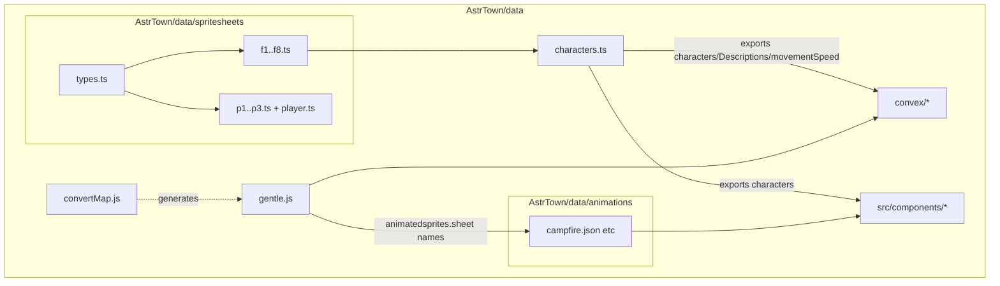

# AstrTown/data 数据层架构分析

> 输出文件：[`plans/架构分析-data.md`](plans/架构分析-data.md)
>
> 说明：
> - 本文所有结论均基于仓库内真实代码/数据文件。
> - 行数/字符数：字符数来自工作区文件清单（见 `# xxxx chars`）；行数来自本次读取或脚本统计。
> - 代码/函数引用格式遵循要求：文件用 [`filename`](path)；函数用 [`functionName`](path:line)。

---

## 1. 模块概述（AstrTown/data）

[`AstrTown/data/`](AstrTown/data) 是 AstrTown 游戏的**静态数据层**，提供三类核心数据：

1. **角色数据**：角色的对话人格描述、精灵贴图与 spritesheet 帧数据、移动速度常量。核心文件：[`AstrTown/data/characters.ts`](AstrTown/data/characters.ts)
2. **地图数据**：背景层/物件层 tilemap（二维/三维数组形式）与地图内“动画精灵”摆放信息。核心文件：[`AstrTown/data/gentle.js`](AstrTown/data/gentle.js)
3. **动画与精灵表数据**：
   - 动画：TexturePacker 风格 spritesheet JSON（frames/animations/meta），在前端 Pixi 侧解析。目录：[`AstrTown/data/animations/`](AstrTown/data/animations)
   - 精灵表：TS 导出的 `SpritesheetData`（frames/animations/meta.scale），供角色 AnimatedSprite 使用。目录：[`AstrTown/data/spritesheets/`](AstrTown/data/spritesheets)

此外，提供一个**离线转换脚本**，把 Tiled 导出的 JSON 地图转换为运行时可 import 的 JS 模块：[`AstrTown/data/convertMap.js`](AstrTown/data/convertMap.js)。

从整体数据流看：
- 服务端（Convex）在初始化时 import 地图与角色描述，将其写入数据库世界状态。
- 客户端（React + Pixi）订阅世界状态后，用地图 tile 数据绘制静态地图，并用动画 JSON + 图片 URL 创建 Pixi `Spritesheet` 播放动画。

---

## 2. 核心功能分类分析

### 2.1 角色数据（[`characters.ts`](AstrTown/data/characters.ts)）
- **身份/计划**：`Descriptions` 是一组 agent/NPC 的对话设定（name、character、identity、plan）。
- **渲染资源**：`characters` 将角色名（f1..f8）映射到统一纹理（`/ai-town/assets/32x32folk.png`）与各自 spritesheetData。
- **移动常量**：`movementSpeed`（单位：tiles/second）在寻路/运动时间计算中使用。

### 2.2 地图转换（[`convertMap.js`](AstrTown/data/convertMap.js)）
- 读取 Tiled JSON（通过命令行参数给出路径）。
- 将每个 layer 的一维 tile 数组转为 `[x][y]` 二维数组，并用 `-1` 将 Tiled tile id 转为以 0 为基（详见 [`convertLayerData`](AstrTown/data/convertMap.js:34)）。
- 输出 ES module（`export const tilesetpath...` + `export const <layerName> = ...`）到 `converted-map.js`。

### 2.3 游戏地图（[`gentle.js`](AstrTown/data/gentle.js)）
- 包含 tileset 信息、背景层 `bgtiles`、物件层 `objmap`，以及 `animatedsprites`（地图上需要播放 spritesheet 动画的对象列表）。
- 导出 `mapwidth/mapheight` 作为派生尺寸（基于 `bgtiles`）。

### 2.4 动画数据（[`animations/`](AstrTown/data/animations)）
- 每个 JSON 文件形态一致：
  - `frames`: 帧名 → `frame{x,y,w,h}` 等
  - `animations`: 动画名 → 帧名序列
  - `meta`: `image/size/scale`
- 在前端地图渲染中被 import，并用于构建 `PIXI.Spritesheet`。

### 2.5 精灵表数据（[`spritesheets/`](AstrTown/data/spritesheets)）
- `types.ts` 定义最小 spritesheet 数据结构（frames/animations/meta.scale）。
- `f1..f8` 与 `p1..p3/player` 以 `export const data: SpritesheetData = {...}` 形式导出，供角色渲染与动画使用。

---

## 3. 详细分析（逐文件）

> 每个文件均按以下 6 部分展开：
> 1) 文件基本信息 2) 导入的模块 3) 导出的内容 4) 定义的函数和变量 5) 文件内部关系 6) 文件间关系

---

### 3.1 [`AstrTown/data/characters.ts`](AstrTown/data/characters.ts)

#### 1) 文件基本信息

| 项 | 值 |
|---|---|
| 路径 | [`AstrTown/data/characters.ts`](AstrTown/data/characters.ts) |
| 功能概述 | 定义可用角色（渲染用 spritesheet + 纹理 URL）与 agent/NPC 描述（用于对话人格/目标），并导出移动速度常量。 |
| 行数 | 121 |
| 字符数 | 4729 chars |

#### 2) 导入的模块

| import | 来源 | 作用 |
|---|---|---|
| `data as f1SpritesheetData` | [`./spritesheets/f1`](AstrTown/data/spritesheets/f1.ts) | 角色 f1 的帧/动画数据（SpritesheetData）。 |
| `data as f2SpritesheetData` | [`./spritesheets/f2`](AstrTown/data/spritesheets/f2.ts) | 角色 f2 的帧/动画数据。 |
| `data as f3SpritesheetData` | [`./spritesheets/f3`](AstrTown/data/spritesheets/f3.ts) | 角色 f3 的帧/动画数据。 |
| `data as f4SpritesheetData` | [`./spritesheets/f4`](AstrTown/data/spritesheets/f4.ts) | 角色 f4 的帧/动画数据。 |
| `data as f5SpritesheetData` | [`./spritesheets/f5`](AstrTown/data/spritesheets/f5.ts) | 角色 f5 的帧/动画数据。 |
| `data as f6SpritesheetData` | [`./spritesheets/f6`](AstrTown/data/spritesheets/f6.ts) | 角色 f6 的帧/动画数据。 |
| `data as f7SpritesheetData` | [`./spritesheets/f7`](AstrTown/data/spritesheets/f7.ts) | 角色 f7 的帧/动画数据。 |
| `data as f8SpritesheetData` | [`./spritesheets/f8`](AstrTown/data/spritesheets/f8.ts) | 角色 f8 的帧/动画数据。 |

#### 3) 导出的内容

| export | 类型 | 用途 |
|---|---|---|
| `Descriptions` | `Array<{name, character, identity, plan}>` | 作为智能体/角色对话的“人格与目标”数据源，在服务端初始化/输入构造时使用。 |
| `characters` | `Array<{name, textureUrl, spritesheetData, speed}>` | 作为渲染层的角色资源表（纹理 URL + spritesheetData）。前端 Player/Character 渲染会按 name 查找。 |
| `movementSpeed` | `number` | 移动速度常量（注释说明为 0.75 tiles/second），在运动时间计算中使用。 |

#### 4) 定义的函数和变量

- `Descriptions`：数组字面量。当前只有一个启用条目（`name: '路西'`），其余角色条目被注释。
- `characters`：数组字面量，包含 8 个条目（f1..f8），共同点：
  - `textureUrl: '/ai-town/assets/32x32folk.png'`
  - `speed: 0.1`
  - `spritesheetData` 来自对应 `fN` 的 import。
- `movementSpeed`：常量数值 `0.75`。

#### 5) 文件内部关系
- 文件内部无函数调用链；主要是“导入 spritesheetData → 组装 `characters` 导出”。

#### 6) 文件间关系

**被引用（已在仓库中检索到的直接引用点）**：

| 引用方 | 引用内容 | 作用 |
|---|---|---|
| [`AstrTown/src/components/Player.tsx`](AstrTown/src/components/Player.tsx) | `characters` | 前端玩家/角色渲染按选择的角色名取到纹理与 spritesheetData。 |
| [`AstrTown/convex/world.ts`](AstrTown/convex/world.ts) | `characters` | 服务端世界逻辑中使用角色表。 |
| [`AstrTown/convex/aiTown/player.ts`](AstrTown/convex/aiTown/player.ts) | `characters` | 服务端玩家对象/描述构造使用。 |
| [`AstrTown/convex/init.ts`](AstrTown/convex/init.ts) | `Descriptions` | 初始化世界时写入描述信息（agent 人格）。 |
| [`AstrTown/convex/npcService.ts`](AstrTown/convex/npcService.ts) | `Descriptions` | NPC 服务侧使用描述信息。 |
| [`AstrTown/convex/aiTown/agentInputs.ts`](AstrTown/convex/aiTown/agentInputs.ts) | `Descriptions` | 构造 agent 输入时使用人格/计划。 |
| [`AstrTown/convex/aiTown/movement.ts`](AstrTown/convex/aiTown/movement.ts) | `movementSpeed` | 按速度将路径段长度换算成耗时。 |

**引用了哪些文件**：
- 仅引用 spritesheet 数据文件：[`AstrTown/data/spritesheets/f1.ts`](AstrTown/data/spritesheets/f1.ts) … [`f8.ts`](AstrTown/data/spritesheets/f8.ts)。

**架构位置与作用**：
- 作为“角色静态数据源”，同时服务端（初始化/agent 输入/运动）与客户端（渲染）都会依赖它，属于跨端共享的数据契约文件。

---

### 3.2 [`AstrTown/data/convertMap.js`](AstrTown/data/convertMap.js)

#### 1) 文件基本信息

| 项 | 值 |
|---|---|
| 路径 | [`AstrTown/data/convertMap.js`](AstrTown/data/convertMap.js) |
| 功能概述 | 离线脚本：将 Tiled 导出的 JSON tilemap 转换为游戏可 import 的 ES module（生成 `converted-map.js`）。 |
| 行数 | 74 |
| 字符数 | 2795 chars |

#### 2) 导入的模块

| import | 来源 | 作用 |
|---|---|---|
| `fs` | Node 内置模块 `fs` | 读取 map JSON、写出转换后的 JS 文件。 |
| `process` | Node 内置模块 `process` | 读取命令行参数 `process.argv`。 |

#### 3) 导出的内容
- 无（该文件是脚本，不作为库模块导出）。

#### 4) 定义的函数和变量

- `mapDataPath: string | undefined`：`process.argv[2]`，map JSON 路径；缺失则抛错。
- `assetPath: string | undefined`：`process.argv[3]`，tileset 图片资源路径字符串；缺失则抛错。
- `tilesetpxw/tilesetpxh: number`：从 argv 解析 tileset 像素尺寸；非数字则抛错。
- `tiledMapData: any`：`JSON.parse(fs.readFileSync(...))` 结果。
- `tileDimension/width/height: number`：从 Tiled JSON 提取 `tilewidth/width/height`。
- [`convertLayerData()`](AstrTown/data/convertMap.js:34)
  - 参数：`(layerData, width, height)`
  - 返回：`[newArray]`（数组包裹的二维数组）
  - 逻辑：按 `x` 外循环、`y` 内循环把 1D 数组映射到 `newArray[x][y]`，并对每个 tile id 执行 `- 1`。
- `jsContent: string`：拼接导出的 JS 模块内容。

#### 5) 文件内部关系

脚本流程：
1. 读取并校验命令行参数（`mapDataPath/assetPath/tilesetpxw/tilesetpxh`）。
2. 读取并解析 JSON 为 `tiledMapData`。
3. 通过 [`convertLayerData()`](AstrTown/data/convertMap.js:34) 处理 `tiledMapData.layers` 的每一层：
   - `tiledMapData.layers.forEach(layer => { ... })`
   - 生成 `export const ${layer.name} = ...`。
4. 追加 `animatedsprites`（当前为 TODO，输出空数组）。
5. 若存在 layer，写出 `mapwidth/mapheight`（取首层宽高）。
6. 写文件 `converted-map.js`，并 `console.log` 完成信息。

#### 6) 文件间关系

**被引用**：
- 该脚本不作为运行时依赖被 import；但在文档中被提到用于更新地图：[`AstrTown/ORIGINAL_README.md`](AstrTown/ORIGINAL_README.md) 中描述使用 `node data/convertMap.js ...` 生成可用地图模块。

**引用了哪些文件**：
- 运行时读取外部的 Tiled JSON（由参数提供），并写出 `converted-map.js` 到当前工作目录。

**架构位置与作用**：
- 属于“资产管线工具”（asset pipeline），将编辑器格式（Tiled JSON）转换为引擎可消费的数据结构。

---

### 3.3 [`AstrTown/data/gentle.js`](AstrTown/data/gentle.js)

#### 1) 文件基本信息

| 项 | 值 |
|---|---|
| 路径 | [`AstrTown/data/gentle.js`](AstrTown/data/gentle.js) |
| 功能概述 | 地图数据模块：导出 tileset 信息、背景/物件 tilemap、地图上动画精灵摆放列表，并导出地图尺寸。 |
| 行数 | 330（本次读取到 1-330 行） |
| 字符数 | 73331 chars |

#### 2) 导入的模块
- 无 import。

#### 3) 导出的内容

| export | 类型 | 用途 |
|---|---|---|
| `tilesetpath` | `string` | tileset 图片路径（如 `/ai-town/assets/gentle-obj.png`）。 |
| `tiledim` | `number` | 单个 tile 边长（像素）。 |
| `screenxtiles/screenytiles` | `number` | 地图宽高（tile 数）。 |
| `tilesetpxw/tilesetpxh` | `number` | tileset 图片像素宽高。 |
| `bgtiles` | `number[][][]` | 背景层 tile 数据（外层包裹一层数组）。 |
| `objmap` | `number[][][]` | 物件层 tile 数据（外层包裹一层数组）。 |
| `animatedsprites` | `Array<{x,y,w,h,layer,sheet,animation}>` | 动画精灵的摆放列表；`sheet` 对应 `animations/*.json`。 |
| `mapwidth` | `number` | `bgtiles[0].length`。 |
| `mapheight` | `number` | `bgtiles[0][0].length`。 |

#### 4) 定义的函数和变量
- 全部为常量导出（`export const ...`），无函数定义。
- `bgtiles/objmap`：数值数组中 `-1` 常用于表示空 tile。
- `animatedsprites`：包含多个对象，示例：
  - `sheet: "campfire.json"`、`animation: "pixels_large"`
  - `sheet: "gentlewaterfall.json"`（含较大 `h`）
  - `sheet: "windmill.json"`（`w/h` 208）
  - `layer` 字段用于区分渲染层级（如 layer 1/2）。

#### 5) 文件内部关系
- 无函数/类；数据之间的唯一派生关系是：
  - `mapwidth` 由 `bgtiles[0].length` 推导
  - `mapheight` 由 `bgtiles[0][0].length` 推导

#### 6) 文件间关系

**被引用（直接 import）**：

| 引用方 | 引用内容 | 作用 |
|---|---|---|
| [`AstrTown/convex/init.ts`](AstrTown/convex/init.ts) | `import * as map from '../data/gentle'` | 服务端初始化时读取地图静态数据并写入数据库世界状态。 |

**引用了哪些文件**：
- 无 import，但其 `animatedsprites[].sheet` 字符串与动画 JSON 文件名形成“约定式关联”（消费方会用 `sheet` 选择 JSON 与 PNG 资源）。

**架构位置与作用**：
- 作为“默认世界地图”的静态数据源，同时供服务端初始化与客户端渲染间接使用。

---

### 3.4 动画数据文件（[`AstrTown/data/animations/`](AstrTown/data/animations)）

> 这组文件均为 spritesheet JSON 数据；它们在前端 [`PixiStaticMap`](AstrTown/src/components/PixiStaticMap.tsx:28) 内被 import 并传入 `PIXI.Spritesheet` 解析。

#### 3.4.1 [`AstrTown/data/animations/campfire.json`](AstrTown/data/animations/campfire.json)

##### 1) 文件基本信息

| 项 | 值 |
|---|---|
| 路径 | [`AstrTown/data/animations/campfire.json`](AstrTown/data/animations/campfire.json) |
| 功能概述 | 篝火动画 spritesheet 定义：frames + animations + meta。 |
| 行数 | 45 |
| 字符数 | 1033 chars |

##### 2) 导入的模块
- 无（JSON 数据文件）。

##### 3) 导出的内容
- 作为 JSON module 被 import：`frames/animations/meta` 对象结构。

##### 4) 定义的函数和变量
- 无函数；数据字段：
  - `animations.pixels_large`：4 帧序列 `pixels_large1.png`..`4.png`
  - `meta.image`：`"./spritesheets/campfire.png"`

##### 5) 文件内部关系
- `animations` 引用 `frames` 的 key 作为帧序列。

##### 6) 文件间关系

| 引用方 | 用途 |
|---|---|
| [`AstrTown/src/components/PixiStaticMap.tsx`](AstrTown/src/components/PixiStaticMap.tsx) | 构建 `PIXI.Spritesheet` 并用于 AnimatedSprite 播放。 |
| [`AstrTown/data/gentle.js`](AstrTown/data/gentle.js) | `animatedsprites[].sheet` 使用 `"campfire.json"` 引用该动画定义。 |

---

#### 3.4.2 [`AstrTown/data/animations/gentlesparkle.json`](AstrTown/data/animations/gentlesparkle.json)

##### 1) 文件基本信息

| 项 | 值 |
|---|---|
| 路径 | [`AstrTown/data/animations/gentlesparkle.json`](AstrTown/data/animations/gentlesparkle.json) |
| 功能概述 | 闪烁粒子动画 spritesheet 定义。 |
| 行数 | （未单独读取行号；字符数来自文件清单） |
| 字符数 | 827 chars |

##### 2) 导入的模块
- 无。

##### 3) 导出的内容
- JSON module 数据对象。

##### 4) 定义的函数和变量
- 无函数；包含 `frames/animations/meta`。

##### 5) 文件内部关系
- `animations` 引用 `frames` key。

##### 6) 文件间关系
- 被 [`PixiStaticMap`](AstrTown/src/components/PixiStaticMap.tsx:28) import。
- 被 [`gentle.js`](AstrTown/data/gentle.js) 的 `animatedsprites` 多处使用（`sheet: "gentlesparkle.json"`）。

---

#### 3.4.3 [`AstrTown/data/animations/gentlesplash.json`](AstrTown/data/animations/gentlesplash.json)

##### 1) 文件基本信息

| 项 | 值 |
|---|---|
| 路径 | [`AstrTown/data/animations/gentlesplash.json`](AstrTown/data/animations/gentlesplash.json) |
| 功能概述 | 水花动画 spritesheet 定义。 |
| 行数 | （未单独读取行号；字符数来自文件清单） |
| 字符数 | 1479 chars |

##### 2) 导入的模块
- 无。

##### 3) 导出的内容
- JSON module 数据对象。

##### 4) 定义的函数和变量
- 无函数；包含 `frames/animations/meta`。

##### 5) 文件内部关系
- `animations` 引用 `frames` key。

##### 6) 文件间关系
- 被 [`PixiStaticMap`](AstrTown/src/components/PixiStaticMap.tsx:28) import。
- 被 [`gentle.js`](AstrTown/data/gentle.js) 的 `animatedsprites` 使用（`sheet: "gentlesplash.json"`，并且 `layer: 2`）。

---

#### 3.4.4 [`AstrTown/data/animations/gentlewaterfall.json`](AstrTown/data/animations/gentlewaterfall.json)

##### 1) 文件基本信息

| 项 | 值 |
|---|---|
| 路径 | [`AstrTown/data/animations/gentlewaterfall.json`](AstrTown/data/animations/gentlewaterfall.json) |
| 功能概述 | 瀑布动画 spritesheet 定义。 |
| 行数 | （未单独读取行号；字符数来自文件清单） |
| 字符数 | 1473 chars |

##### 2) 导入的模块
- 无。

##### 3) 导出的内容
- JSON module 数据对象。

##### 4) 定义的函数和变量
- 无函数；包含 `frames/animations/meta`。

##### 5) 文件内部关系
- `animations` 引用 `frames` key。

##### 6) 文件间关系
- 被 [`PixiStaticMap`](AstrTown/src/components/PixiStaticMap.tsx:28) import。
- 被 [`gentle.js`](AstrTown/data/gentle.js) 的 `animatedsprites` 使用（例如 `w:32,h:96`）。

---

#### 3.4.5 [`AstrTown/data/animations/windmill.json`](AstrTown/data/animations/windmill.json)

##### 1) 文件基本信息

| 项 | 值 |
|---|---|
| 路径 | [`AstrTown/data/animations/windmill.json`](AstrTown/data/animations/windmill.json) |
| 功能概述 | 风车动画 spritesheet 定义（大尺寸帧）。 |
| 行数 | （未单独读取行号；字符数来自文件清单） |
| 字符数 | 2485 chars |

##### 2) 导入的模块
- 无。

##### 3) 导出的内容
- JSON module 数据对象。

##### 4) 定义的函数和变量
- 无函数；包含 `frames/animations/meta`。

##### 5) 文件内部关系
- `animations` 引用 `frames` key。

##### 6) 文件间关系
- 被 [`PixiStaticMap`](AstrTown/src/components/PixiStaticMap.tsx:28) import。
- 被 [`gentle.js`](AstrTown/data/gentle.js) 的 `animatedsprites` 使用（如 `w/h: 208`）。

---

### 3.5 精灵表数据文件（[`AstrTown/data/spritesheets/`](AstrTown/data/spritesheets)）

> 这些文件提供角色行走动画的帧坐标与动画序列定义。它们通过 [`characters.ts`](AstrTown/data/characters.ts) 组合后，成为跨端共享的角色资源表。

#### 3.5.1 [`AstrTown/data/spritesheets/types.ts`](AstrTown/data/spritesheets/types.ts)

##### 1) 文件基本信息

| 项 | 值 |
|---|---|
| 路径 | [`AstrTown/data/spritesheets/types.ts`](AstrTown/data/spritesheets/types.ts) |
| 功能概述 | 定义 `Frame` 与 `SpritesheetData` 类型，为 spritesheet 数据提供最小结构约束。 |
| 行数 | 26 |
| 字符数 | 421 chars |

##### 2) 导入的模块
- 无。

##### 3) 导出的内容

| export | 类型 | 用途 |
|---|---|---|
| `Frame` | type | 描述单帧在 spritesheet 中的坐标与源尺寸信息。 |
| `SpritesheetData` | type | 描述 frames（必需）、animations（可选）、meta.scale（必需）。 |

##### 4) 定义的函数和变量
- 无运行时代码；仅类型定义。

##### 5) 文件内部关系
- `SpritesheetData.frames` 的 value 类型为 `Frame`。

##### 6) 文件间关系
- 被所有 spritesheet 数据文件 import（例如 [`f1.ts`](AstrTown/data/spritesheets/f1.ts:1)、[`player.ts`](AstrTown/data/spritesheets/player.ts:1) 等）。

---

#### 3.5.2 [`AstrTown/data/spritesheets/f1.ts`](AstrTown/data/spritesheets/f1.ts)

##### 1) 文件基本信息

| 项 | 值 |
|---|---|
| 路径 | [`AstrTown/data/spritesheets/f1.ts`](AstrTown/data/spritesheets/f1.ts) |
| 功能概述 | 角色 f1 的 32x32 帧坐标与四方向行走动画序列。 |
| 行数 | 75 |
| 字符数 | 2056 chars |

##### 2) 导入的模块

| import | 来源 | 作用 |
|---|---|---|
| `SpritesheetData` | [`./types`](AstrTown/data/spritesheets/types.ts) | 约束导出的 `data` 结构。 |

##### 3) 导出的内容

| export | 类型 | 用途 |
|---|---|---|
| `data` | `SpritesheetData` | 提供 `frames`（left/right/up/down + 2/3）与 `animations`（四方向序列）。 |

##### 4) 定义的函数和变量
- `data.frames`：包含 `left/left2/left3/right/.../down3`。
- `data.animations`：`left/right/up/down` 各自为 3 帧循环序列。

##### 5) 文件内部关系
- `animations` 的 frame name 需存在于 `frames`。

##### 6) 文件间关系
- 被 [`characters.ts`](AstrTown/data/characters.ts:1) import 并作为 f1 的 `spritesheetData`。

---

#### 3.5.3 [`AstrTown/data/spritesheets/f2.ts`](AstrTown/data/spritesheets/f2.ts)

##### 1) 文件基本信息

| 项 | 值 |
|---|---|
| 路径 | [`AstrTown/data/spritesheets/f2.ts`](AstrTown/data/spritesheets/f2.ts) |
| 功能概述 | 角色 f2 的 spritesheet 数据（32x32）。 |
| 行数 | （未单独读取行号；字符数来自文件清单） |
| 字符数 | 2068 chars |

##### 2) 导入的模块
- `SpritesheetData` 来自 [`types.ts`](AstrTown/data/spritesheets/types.ts)。

##### 3) 导出的内容
- `export const data: SpritesheetData = {...}`。

##### 4) 定义的函数和变量
- frames + animations（与 f1 同模式）。

##### 5) 文件内部关系
- animations 引用 frames keys。

##### 6) 文件间关系
- 被 [`characters.ts`](AstrTown/data/characters.ts:2) import。

---

#### 3.5.4 [`AstrTown/data/spritesheets/f3.ts`](AstrTown/data/spritesheets/f3.ts)

##### 1) 文件基本信息

| 项 | 值 |
|---|---|
| 路径 | [`AstrTown/data/spritesheets/f3.ts`](AstrTown/data/spritesheets/f3.ts) |
| 功能概述 | 角色 f3 的 spritesheet 数据（32x32）。 |
| 行数 | （未单独读取行号；字符数来自文件清单） |
| 字符数 | 2072 chars |

##### 2) 导入的模块
- `SpritesheetData` 来自 [`types.ts`](AstrTown/data/spritesheets/types.ts)。

##### 3) 导出的内容
- `data`。

##### 4) 定义的函数和变量
- frames + animations。

##### 5) 文件内部关系
- animations 引用 frames。

##### 6) 文件间关系
- 被 [`characters.ts`](AstrTown/data/characters.ts:3) import。

---

#### 3.5.5 [`AstrTown/data/spritesheets/f4.ts`](AstrTown/data/spritesheets/f4.ts)

##### 1) 文件基本信息

| 项 | 值 |
|---|---|
| 路径 | [`AstrTown/data/spritesheets/f4.ts`](AstrTown/data/spritesheets/f4.ts) |
| 功能概述 | 角色 f4 的 spritesheet 数据（32x32）。 |
| 行数 | （未单独读取行号；字符数来自文件清单） |
| 字符数 | 2072 chars |

##### 2) 导入的模块
- `SpritesheetData` 来自 [`types.ts`](AstrTown/data/spritesheets/types.ts)。

##### 3) 导出的内容
- `data`。

##### 4) 定义的函数和变量
- frames + animations。

##### 5) 文件内部关系
- animations 引用 frames。

##### 6) 文件间关系
- 被 [`characters.ts`](AstrTown/data/characters.ts:4) import。

---

#### 3.5.6 [`AstrTown/data/spritesheets/f5.ts`](AstrTown/data/spritesheets/f5.ts)

##### 1) 文件基本信息

| 项 | 值 |
|---|---|
| 路径 | [`AstrTown/data/spritesheets/f5.ts`](AstrTown/data/spritesheets/f5.ts) |
| 功能概述 | 角色 f5 的 spritesheet 数据（32x32）。 |
| 行数 | （未单独读取行号；字符数来自文件清单） |
| 字符数 | 2071 chars |

##### 2) 导入的模块
- `SpritesheetData` 来自 [`types.ts`](AstrTown/data/spritesheets/types.ts)。

##### 3) 导出的内容
- `data`。

##### 4) 定义的函数和变量
- frames + animations。

##### 5) 文件内部关系
- animations 引用 frames。

##### 6) 文件间关系
- 被 [`characters.ts`](AstrTown/data/characters.ts:5) import。

---

#### 3.5.7 [`AstrTown/data/spritesheets/f6.ts`](AstrTown/data/spritesheets/f6.ts)

##### 1) 文件基本信息

| 项 | 值 |
|---|---|
| 路径 | [`AstrTown/data/spritesheets/f6.ts`](AstrTown/data/spritesheets/f6.ts) |
| 功能概述 | 角色 f6 的 spritesheet 数据（32x32）。 |
| 行数 | （未单独读取行号；字符数来自文件清单） |
| 字符数 | 2083 chars |

##### 2) 导入的模块
- `SpritesheetData` 来自 [`types.ts`](AstrTown/data/spritesheets/types.ts)。

##### 3) 导出的内容
- `data`。

##### 4) 定义的函数和变量
- frames + animations。

##### 5) 文件内部关系
- animations 引用 frames。

##### 6) 文件间关系
- 被 [`characters.ts`](AstrTown/data/characters.ts:6) import。

---

#### 3.5.8 [`AstrTown/data/spritesheets/f7.ts`](AstrTown/data/spritesheets/f7.ts)

##### 1) 文件基本信息

| 项 | 值 |
|---|---|
| 路径 | [`AstrTown/data/spritesheets/f7.ts`](AstrTown/data/spritesheets/f7.ts) |
| 功能概述 | 角色 f7 的 spritesheet 数据（32x32）。 |
| 行数 | （未单独读取行号；字符数来自文件清单） |
| 字符数 | 2087 chars |

##### 2) 导入的模块
- `SpritesheetData` 来自 [`types.ts`](AstrTown/data/spritesheets/types.ts)。

##### 3) 导出的内容
- `data`。

##### 4) 定义的函数和变量
- frames + animations。

##### 5) 文件内部关系
- animations 引用 frames。

##### 6) 文件间关系
- 被 [`characters.ts`](AstrTown/data/characters.ts:7) import。

---

#### 3.5.9 [`AstrTown/data/spritesheets/f8.ts`](AstrTown/data/spritesheets/f8.ts)

##### 1) 文件基本信息

| 项 | 值 |
|---|---|
| 路径 | [`AstrTown/data/spritesheets/f8.ts`](AstrTown/data/spritesheets/f8.ts) |
| 功能概述 | 角色 f8 的 spritesheet 数据（32x32）。 |
| 行数 | （未单独读取行号；字符数来自文件清单） |
| 字符数 | 2087 chars |

##### 2) 导入的模块
- `SpritesheetData` 来自 [`types.ts`](AstrTown/data/spritesheets/types.ts)。

##### 3) 导出的内容
- `data`。

##### 4) 定义的函数和变量
- frames + animations。

##### 5) 文件内部关系
- animations 引用 frames。

##### 6) 文件间关系
- 被 [`characters.ts`](AstrTown/data/characters.ts:8) import。

---

#### 3.5.10 [`AstrTown/data/spritesheets/p1.ts`](AstrTown/data/spritesheets/p1.ts)

##### 1) 文件基本信息

| 项 | 值 |
|---|---|
| 路径 | [`AstrTown/data/spritesheets/p1.ts`](AstrTown/data/spritesheets/p1.ts) |
| 功能概述 | 16x16 角色/玩家样式之一的 spritesheet 数据。 |
| 行数 | 59 |
| 字符数 | 1572 chars |

##### 2) 导入的模块
- `SpritesheetData` 来自 [`types.ts`](AstrTown/data/spritesheets/types.ts)。

##### 3) 导出的内容
- `data`。

##### 4) 定义的函数和变量
- frames（left/up/down + 2/3），animations（left/up/down）。

##### 5) 文件内部关系
- animations 引用 frames。

##### 6) 文件间关系
- 当前在 `data/characters.ts` 中未看到对 `p1` 的引用；其使用点需另行在仓库中按需检索。

---

#### 3.5.11 [`AstrTown/data/spritesheets/p2.ts`](AstrTown/data/spritesheets/p2.ts)

##### 1) 文件基本信息

| 项 | 值 |
|---|---|
| 路径 | [`AstrTown/data/spritesheets/p2.ts`](AstrTown/data/spritesheets/p2.ts) |
| 功能概述 | 16x16 样式之二 spritesheet 数据。 |
| 行数 | （未单独读取行号；字符数来自文件清单） |
| 字符数 | 1581 chars |

##### 2) 导入的模块
- `SpritesheetData` 来自 [`types.ts`](AstrTown/data/spritesheets/types.ts)。

##### 3) 导出的内容
- `data`。

##### 4) 定义的函数和变量
- frames + animations。

##### 5) 文件内部关系
- animations 引用 frames。

##### 6) 文件间关系
- 使用点需另行检索确认。

---

#### 3.5.12 [`AstrTown/data/spritesheets/p3.ts`](AstrTown/data/spritesheets/p3.ts)

##### 1) 文件基本信息

| 项 | 值 |
|---|---|
| 路径 | [`AstrTown/data/spritesheets/p3.ts`](AstrTown/data/spritesheets/p3.ts) |
| 功能概述 | 16x16 样式之三 spritesheet 数据。 |
| 行数 | （未单独读取行号；字符数来自文件清单） |
| 字符数 | 1581 chars |

##### 2) 导入的模块
- `SpritesheetData` 来自 [`types.ts`](AstrTown/data/spritesheets/types.ts)。

##### 3) 导出的内容
- `data`。

##### 4) 定义的函数和变量
- frames + animations。

##### 5) 文件内部关系
- animations 引用 frames。

##### 6) 文件间关系
- 使用点需另行检索确认。

---

#### 3.5.13 [`AstrTown/data/spritesheets/player.ts`](AstrTown/data/spritesheets/player.ts)

##### 1) 文件基本信息

| 项 | 值 |
|---|---|
| 路径 | [`AstrTown/data/spritesheets/player.ts`](AstrTown/data/spritesheets/player.ts) |
| 功能概述 | 一个基础玩家 spritesheet（16x16），提供 left/up/down 三方向动画（未定义 right）。 |
| 行数 | 59 |
| 字符数 | 1574 chars |

##### 2) 导入的模块

| import | 来源 | 作用 |
|---|---|---|
| `SpritesheetData` | [`./types`](AstrTown/data/spritesheets/types.ts) | 约束 `data` 结构。 |

##### 3) 导出的内容

| export | 类型 | 用途 |
|---|---|---|
| `data` | `SpritesheetData` | frames（left/up/down + 2/3）与 animations（left/up/down）。 |

##### 4) 定义的函数和变量
- `frames`：包含 `left/left2/left3/up.../down...`。
- `animations`：仅有 `left/up/down`。

##### 5) 文件内部关系
- animations 引用 frames。

##### 6) 文件间关系
- 在当前已检索到的 `characters.ts` 中未使用该 spritesheet；其消费点需要全仓库进一步检索。

---

## 4. 模块关系图（依赖关系文字图）

### 4.1 文字版依赖关系

- [`AstrTown/data/spritesheets/types.ts`](AstrTown/data/spritesheets/types.ts)
  - 被所有 spritesheet 文件依赖（`import { SpritesheetData } from './types'`）。
- [`AstrTown/data/spritesheets/f1.ts`](AstrTown/data/spritesheets/f1.ts) … [`f8.ts`](AstrTown/data/spritesheets/f8.ts)
  - 被 [`AstrTown/data/characters.ts`](AstrTown/data/characters.ts) 组合为 `characters` 导出。
- [`AstrTown/data/characters.ts`](AstrTown/data/characters.ts)
  - 被服务端世界/agent 输入/移动逻辑引用（Convex）。
  - 被前端玩家渲染引用（React/Pixi）。
- [`AstrTown/data/gentle.js`](AstrTown/data/gentle.js)
  - 被服务端初始化 import（`convex/init.ts`），写入数据库。
  - 其 `animatedsprites[].sheet` 与 [`AstrTown/data/animations/*.json`](AstrTown/data/animations) 形成约定关联。
- [`AstrTown/data/animations/*.json`](AstrTown/data/animations)
  - 被前端地图渲染组件 [`PixiStaticMap`](AstrTown/src/components/PixiStaticMap.tsx:28) import 并解析。
- [`AstrTown/data/convertMap.js`](AstrTown/data/convertMap.js)
  - 作为工具脚本不被 import；用于将 Tiled JSON 转换成类似 [`gentle.js`](AstrTown/data/gentle.js) 的模块形式（参见 [`AstrTown/ORIGINAL_README.md`](AstrTown/ORIGINAL_README.md)）。

### 4.2 Mermaid（高层）

---

## 5. 数据流分析（跨模块/跨端）

### 5.1 世界初始化：data → convex → DB

1. Convex 初始化逻辑在 [`AstrTown/convex/init.ts`](AstrTown/convex/init.ts) 中：
   - `import { Descriptions } from '../data/characters'`
   - `import * as map from '../data/gentle'`
2. 该初始化把地图（`bgtiles/objmap/animatedsprites` 等）与角色描述（`Descriptions`）写入数据库世界状态（maps/world 等表）。

### 5.2 前端渲染：DB → hooks → Pixi

1. 前端通过 `serverGame` 等 hooks 订阅世界状态（见仓库现有分析文档：[`plans/架构分析-src-其他.md`](plans/架构分析-src-其他.md) 中对 `serverGame.ts` 的描述）。
2. 地图渲染组件 [`PixiStaticMap`](AstrTown/src/components/PixiStaticMap.tsx:28) 消费 `WorldMap`：
   - 使用 `bgTiles/objectTiles` 绘制静态 tile。
   - 遍历 `animatedSprites`，按 `sheet` 分组选择对应 JSON（例如 `campfire.json`），并基于 `meta.image` 构造图片 URL，创建 `PIXI.Spritesheet`，然后以 AnimatedSprite 播放 `animation`。
3. 玩家渲染组件 [`Player`](AstrTown/src/components/Player.tsx:18) 通过 `characters` 表取得角色纹理与 `spritesheetData`，并委托给 [`Character`](AstrTown/src/components/Character.tsx:9) 进行 AnimatedSprite 渲染。

---

## 6. 关键算法（实现描述）

### 6.1 地图 layer 数据转换（Tiled 1D → 引擎 2D/3D）

实现位于 [`convertLayerData`](AstrTown/data/convertMap.js:34)：
- 输入：Tiled layer 的 `data`（一维数组，按行主序）与 `width/height`。
- 输出：`[newArray]`，其中 `newArray[x][y]`。
- 核心映射公式：`newArray[i][j] = layerData[j * width + i] - 1`。
  - `-1` 偏移使 tile id 与引擎内部索引对齐（并保留 `-1` 作为空）。

### 6.2 地图动画 spritesheet 的缓存与解析（前端）

动画 JSON 在 [`PixiStaticMap`](AstrTown/src/components/PixiStaticMap.tsx:28) 中被 import，并在运行时为 `PIXI.Spritesheet`。
- 组件使用模块级缓存（`spritesheetCache: Map<string, Promise<PIXI.Spritesheet>>`，来自项目现有分析文档摘录）避免重复 parse 导致 Pixi TextureCache 冲突/重复解析。
- `animatedsprites[].sheet` 作为 key 决定选用哪一个 JSON 数据对象，并结合 `meta.image` 定位 PNG。

### 6.3 移动耗时计算使用共享常量 movementSpeed

在 [`AstrTown/convex/aiTown/movement.ts`](AstrTown/convex/aiTown/movement.ts) 中 import `movementSpeed`（来自 [`characters.ts`](AstrTown/data/characters.ts:121)），将路径段长度换算为时间增量（单位 ms）。

---

## 7. 需要特别说明的问题（基于现有代码事实）

1. **`convertMap.js` 未生成动画精灵数据**：脚本在输出 `animatedsprites` 处明确写了 `// TODO: Add animated sprites`，当前会生成空数组（见 [`convertMap.js`](AstrTown/data/convertMap.js:59)）。这意味着 [`gentle.js`](AstrTown/data/gentle.js) 的动画摆放信息不是来自该脚本自动生成，而是由其他工具（文件头注释提到 `assettool.js`）生成。
2. **部分 spritesheet（p1/p2/p3/player）当前未在 `characters.ts` 组合**：在 [`characters.ts`](AstrTown/data/characters.ts) 中只引入 `f1..f8`。p 系列是否被其他模块使用，需要以全仓库检索为准（本次输出中未补齐所有使用点）。
3. **`gentle.js` 为大体量数据文件**：字符数 73331，包含大量数组字面量；在工具读取时需注意上下文预算，但关键导出与 `animatedsprites` 已在本次读取中确认。
