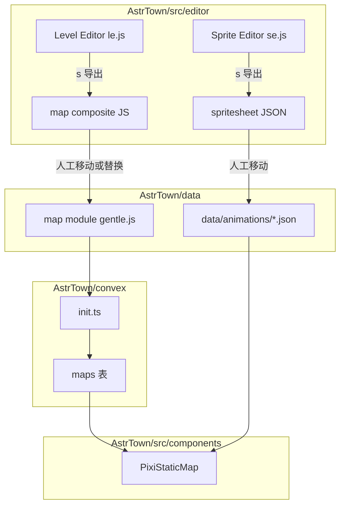

# 架构分析：editor 地图编辑器模块（AstrTown/src/editor）

> 范围：本文件补齐 AstrTown 项目中 **editor 地图编辑器**相关架构分析，覆盖：
> - Level Editor（`le.*`）
> - Sprite Editor（`se.*`）
>
> 说明：本文所有结论均基于仓库内真实代码/资源文件；对入口函数/关键逻辑尽量给出可定位链接。
>
> 关键代码入口（本次实际读取与检索到的核心文件）：
> - [`AstrTown/src/editor/README.md`](../AstrTown/src/editor/README.md)
> - Level Editor：[`le.js`](../AstrTown/src/editor/le.js)、[`lecontext.js`](../AstrTown/src/editor/lecontext.js)、[`leconfig.js`](../AstrTown/src/editor/leconfig.js)、[`lehtmlui.js`](../AstrTown/src/editor/lehtmlui.js)、[`mapfile.js`](../AstrTown/src/editor/mapfile.js)、[`undo.js`](../AstrTown/src/editor/undo.js)、[`eutils.js`](../AstrTown/src/editor/eutils.js)
> - Sprite Editor：[`se.js`](../AstrTown/src/editor/se.js)、[`secontext.js`](../AstrTown/src/editor/secontext.js)、[`seconfig.js`](../AstrTown/src/editor/seconfig.js)、[`sehtmlui.js`](../AstrTown/src/editor/sehtmlui.js)、[`spritefile.js`](../AstrTown/src/editor/spritefile.js)
> - 与后端/前端集成点：[`AstrTown/convex/init.ts`](../AstrTown/convex/init.ts)、[`AstrTown/src/components/PixiStaticMap.tsx`](../AstrTown/src/components/PixiStaticMap.tsx)

---

## 1. 模块概述

### 1.1 editor 模块是什么

`AstrTown/src/editor/` 是一组**与主游戏前端分离**的“资产编辑工具”，以 `Vite + Pixi.js` 直接运行在浏览器中：

- **Level Editor（`le.*`）**：编辑地图多图层 tile（背景层与物件碰撞层），支持笔刷/多选、批量填充、网格显示、删除、撤销，以及导出“地图组合文件（map composite file）”。
- **Sprite Editor（`se.*`）**：从 spritesheet 图片中圈选帧，生成 TexturePacker 风格 JSON（`frames/animations/meta`），用于地图上的 `AnimatedSprite` 播放。

从用途上看，它们是 AstrTown 的**资产管线（asset pipeline）**一环：

- Level Editor 输出的 JS 模块（包含 `bgtiles/objmap/animatedsprites`）可被后端初始化 import 并写入 Convex 的 `maps` 表（见 [`getOrCreateDefaultWorld()`](../AstrTown/convex/init.ts:34)）。
- Sprite Editor 输出的 JSON 会被前端地图渲染 import 并交给 Pixi 解析（见 [`PixiStaticMap`](../AstrTown/src/components/PixiStaticMap.tsx:28)）。

### 1.2 如何启动

- 仓库脚本：`AstrTown/package.json` 中提供 `le` 脚本（见 `"le": "vite src/editor/"` 的检索结果）。
- Docker 侧也提供 `level-editor` 服务，将 `npx vite src/editor/ --port 5174 --base=/map-editor/` 暴露出来（见 [`docker-compose.yml`](../docker-compose.yml:104)）。

Level Editor 的使用说明在 [`AstrTown/src/editor/README.md`](../AstrTown/src/editor/README.md) 中给出，包括快捷键与导出方式。

---

## 2. 文件清单（editor 目录）

> 说明：该清单来自对 `AstrTown/src/editor/` 的递归枚举结果；其中图片/大体量 map 数据属于资源或样例数据。

### 2.1 顶层文件

- 入口与页面：
  - [`AstrTown/src/editor/index.html`](../AstrTown/src/editor/index.html)
  - [`AstrTown/src/editor/le.html`](../AstrTown/src/editor/le.html)
  - [`AstrTown/src/editor/se.html`](../AstrTown/src/editor/se.html)
- Level Editor：
  - [`AstrTown/src/editor/le.js`](../AstrTown/src/editor/le.js)
  - [`AstrTown/src/editor/leconfig.js`](../AstrTown/src/editor/leconfig.js)
  - [`AstrTown/src/editor/lecontext.js`](../AstrTown/src/editor/lecontext.js)
  - [`AstrTown/src/editor/lehtmlui.js`](../AstrTown/src/editor/lehtmlui.js)
  - [`AstrTown/src/editor/mapfile.js`](../AstrTown/src/editor/mapfile.js)
- Sprite Editor：
  - [`AstrTown/src/editor/se.js`](../AstrTown/src/editor/se.js)
  - [`AstrTown/src/editor/seconfig.js`](../AstrTown/src/editor/seconfig.js)
  - [`AstrTown/src/editor/secontext.js`](../AstrTown/src/editor/secontext.js)
  - [`AstrTown/src/editor/sehtmlui.js`](../AstrTown/src/editor/sehtmlui.js)
  - [`AstrTown/src/editor/spritefile.js`](../AstrTown/src/editor/spritefile.js)
- 公共工具：
  - [`AstrTown/src/editor/undo.js`](../AstrTown/src/editor/undo.js)
  - [`AstrTown/src/editor/eutils.js`](../AstrTown/src/editor/eutils.js)
- 其他/杂项：
  - [`AstrTown/src/editor/README.md`](../AstrTown/src/editor/README.md)
  - [`AstrTown/src/editor/vite.config.js`](../AstrTown/src/editor/vite.config.js)
  - [`AstrTown/src/editor/leconfig.js`](../AstrTown/src/editor/leconfig.js)
  - [`AstrTown/src/editor/lecontext.js`](../AstrTown/src/editor/lecontext.js)
  - [`AstrTown/src/editor/seconfig.js`](../AstrTown/src/editor/seconfig.js)
  - [`AstrTown/src/editor/secontext.js`](../AstrTown/src/editor/secontext.js)
  - [`AstrTown/src/editor/undo.js`](../AstrTown/src/editor/undo.js)
  - [`AstrTown/src/editor/eutils.js`](../AstrTown/src/editor/eutils.js)

### 2.2 样例地图（`maps/`）

- [`AstrTown/src/editor/maps/gentle-full.js`](../AstrTown/src/editor/maps/gentle-full.js)
- [`AstrTown/src/editor/maps/gentle.js`](../AstrTown/src/editor/maps/gentle.js)
- [`AstrTown/src/editor/maps/gentleanim.js`](../AstrTown/src/editor/maps/gentleanim.js)
- [`AstrTown/src/editor/maps/mage3.js`](../AstrTown/src/editor/maps/mage3.js)
- [`AstrTown/src/editor/maps/serene.js`](../AstrTown/src/editor/maps/serene.js)

这些文件与运行时地图模块（例如 [`AstrTown/data/gentle.js`](../AstrTown/data/gentle.js)）的结构相似：`tilesetpath/tiledim/bgtiles/objmap/animatedsprites/mapwidth/mapheight`。

### 2.3 资源目录

- tileset（地图 tile 图片）：[`AstrTown/src/editor/tilesets/`](../AstrTown/src/editor/tilesets/)
- spritesheet（动画/精灵图片）：[`AstrTown/src/editor/spritesheets/`](../AstrTown/src/editor/spritesheets/)
- 动画 JSON（供 Level Editor 的 animated sprite 放置时引用）：
  - [`AstrTown/src/editor/campfire.json`](../AstrTown/src/editor/campfire.json)
  - [`AstrTown/src/editor/gentlesparkle.json`](../AstrTown/src/editor/gentlesparkle.json)
  - [`AstrTown/src/editor/gentlesplash.json`](../AstrTown/src/editor/gentlesplash.json)
  - [`AstrTown/src/editor/gentlewaterfall.json`](../AstrTown/src/editor/gentlewaterfall.json)
  - [`AstrTown/src/editor/windmill.json`](../AstrTown/src/editor/windmill.json)

---

## 3. Level Editor（le.*）架构分析

### 3.1 核心对象与职责分层

Level Editor 主要由以下模块构成：

- **全局状态单例 `g_ctx`**：[`g_ctx`](../AstrTown/src/editor/lecontext.js:40)
  - 保存 tileset 参数（像素宽高、tile 数、tileDim、padding、fudge 等）
  - 保存 UI 运行态（当前选中的 tile、选区 `selected_tiles`、删除键状态 `dkey`）
  - 持有 Pixi panes：`g_layers`（多层编辑窗格）、`tileset`（tile 选择窗格）、`composite`（合成预览窗格）

- **配置常量 `CONFIG`**：[`leconfig.js`](../AstrTown/src/editor/leconfig.js)
  - 默认 tileset 路径：[`DEFAULTTILESETPATH`](../AstrTown/src/editor/leconfig.js:1)
  - 画布尺寸（像素）与派生的 tile 维度：`levelwidth/levelheight`、`leveltilewidth/leveltileheight`
  - UI pane 尺寸（scroll 容器）与 zIndex

- **Pixi Pane 实现（`le.js` 内部类）**：
  - `LayerContext`：地图的单层编辑面板（四层：2 层背景 + 2 层物件），管理 tile sprite 的 add/remove 与鼠标交互（见 [`class LayerContext`](../AstrTown/src/editor/le.js:116)）
  - `TilesetContext`：tileset 选择面板，负责 tile 单选与拖拽多选（见 [`class TilesetContext`](../AstrTown/src/editor/le.js:300)）
  - `CompositeContext`：合成预览面板，把各层 sprite 叠在一起，辅助定位与导出截图（见 [`class CompositeContext`](../AstrTown/src/editor/le.js:369)）

- **导出模块（map composite file）**：[`generate_level_file()`](../AstrTown/src/editor/mapfile.js:101)
  - 从各层 Pixi container 收集 tile index，导出 JS 模块：`bgtiles/objmap/animatedsprites` 等常量

- **撤销栈**：[`undo.js`](../AstrTown/src/editor/undo.js)
  - `undo_stack` 存储“任务”（一次拖拽批量绘制/一次填充）
  - Level Editor 扩展了 undo 任务项，保存 `oldValue`，以支持撤销时恢复原 tile（见 [`undo_add_index_to_task()`](../AstrTown/src/editor/undo.js:11) 与 [`keydown ctrl+z`](../AstrTown/src/editor/le.js:570)）

### 3.2 交互与事件流

#### 3.2.1 选择 tile（Tileset 面板）

- 单击：`mousedown` 中计算 `g_ctx.tile_index`（见 [`TilesetContext.constructor`](../AstrTown/src/editor/le.js:302)）。
- 框选：`pointerdown` → `pointermove` → `pointerup` 计算矩形区域并写入 `g_ctx.selected_tiles`（见 [`onTilesetDragStart()`](../AstrTown/src/editor/le.js:634)、[`onTilesetDragEnd()`](../AstrTown/src/editor/le.js:654)）。

`selected_tiles` 的结构是 `[dx, dy, tilesetIndex]`，用于在地图上批量绘制时按相对偏移铺开。

#### 3.2.2 绘制 tile（Layer 面板）

LayerContext 在构造时把 `square` 设置为 `eventMode='static'` 并绑定鼠标事件（见 [`LayerContext.constructor`](../AstrTown/src/editor/le.js:118)）：

- `pointerdown` 启动拖拽绘制（见 [`onLevelPointerDown()`](../AstrTown/src/editor/le.js:968)）
- 拖拽结束 `pointerup`/`pointerupoutside` 进入 [`onLevelDragEnd()`](../AstrTown/src/editor/le.js:1022)

拖拽结束的分支：

- 如果拖拽矩形只覆盖单个 tile：走 [`levelPlaceNoVariable()`](../AstrTown/src/editor/le.js:938)
- 否则：
  - 若无 `selected_tiles`：矩形区域全填同一 tile
  - 若有 `selected_tiles`：构造一个 `selected_grid`，用“九宫格式的边角/边/中”策略进行贴片（见 [`onLevelDragEnd()`](../AstrTown/src/editor/le.js:1087) 一段逻辑）

#### 3.2.3 删除与辅助显示

- 按住 `d` 键进入“删除模式”，通过 `g_ctx.dkey` 控制是否真正 `addChild`（见 [`keydown KeyD`](../AstrTown/src/editor/le.js:543) 与 [`LayerContext.addTileLevelPx`](../AstrTown/src/editor/le.js:269)）。
- `m` 键切换红色 mask 覆盖帮助定位透明 tile（见 [`LayerContext.drawFilter()`](../AstrTown/src/editor/le.js:187) 与 [`keydown KeyM`](../AstrTown/src/editor/le.js:560)）。
- `g` 键切换网格（见 [`redrawGrid()`](../AstrTown/src/editor/le.js:734) 与 [`keydown KeyG`](../AstrTown/src/editor/le.js:565)）。

#### 3.2.4 撤销

- 每次绘制/批量填充会把修改记录 push 到 undo 栈。
- 撤销入口：[`keydown ctrl+z`](../AstrTown/src/editor/le.js:570)
  - 对每个 tileIndex：移除当前 sprite
  - 若 `oldValue !== -1`，重新创建并放回原 tile（见 [`keydown ctrl+z`](../AstrTown/src/editor/le.js:584)）。

### 3.3 状态管理：为何使用 g_ctx

`lecontext.js` 通过单例 `ContextCreate.getInstance()` 提供 `g_ctx`（见 [`getInstance()`](../AstrTown/src/editor/lecontext.js:28)），其作用是：

- 在不引入 React/Redux 的情况下，跨多个 Pixi pane 与 UI handler 共享状态。
- 让 `mapfile.js` 能读取当前编辑状态并导出（见 [`generate_preamble()`](../AstrTown/src/editor/mapfile.js:7)）。

这种做法的代价：
- 状态高度全局、耦合较强；例如“动画精灵”当前通过把 spritesheet 信息临时塞到 `g_ctx` 与 sprite 上实现（见 `HACK` 注释，[`addTileLevelPx`](../AstrTown/src/editor/le.js:241)）。

### 3.4 导出文件格式（map composite file）

Level Editor 的导出由 [`generate_level_file()`](../AstrTown/src/editor/mapfile.js:101) 负责，最终调用 `UTIL.download()` 写出一个 JS 文件（见 [`download()`](../AstrTown/src/editor/eutils.js:3)）。

导出的结构核心字段：

- `tilesetpath: string`
- `tiledim: number`
- `tilesetpxw/tilesetpxh: number`
- `bgtiles: number[][][]`（外层数组表示多背景层；内部为 `[x][y]`）
- `objmap: number[][][]`（外层数组表示多物件层；内部为 `[x][y]`）
- `animatedsprites: Array<{x,y,w,h,layer,sheet,animation}>`（来自“动画 sprite”写入逻辑，见 [`write_map_file()`](../AstrTown/src/editor/mapfile.js:25)）
- `mapwidth/mapheight`（由 tiles 数组派生，见 [`write_map_file()`](../AstrTown/src/editor/mapfile.js:94)）

与项目既有数据模块对应关系：
- 运行时默认地图 [`AstrTown/data/gentle.js`](../AstrTown/data/gentle.js) 使用相同概念字段。
- 后端初始化把其写入 DB maps 表（见 [`ctx.db.insert('maps', ...)`](../AstrTown/convex/init.ts:62)）。

---

## 4. Sprite Editor（se.*）架构分析

### 4.1 目标与产物

Sprite Editor 的目标是：

- 从一张 spritesheet 图片中，按行组织若干帧（每行一组动画帧）。
- 导出一个 TexturePacker 风格 JSON：
  - `frames`：每帧的裁剪矩形
  - `animations`：每行对应一个 `rowN` 动画序列
  - `meta.image`：图片路径

导出入口：[`generate_sprite_file()`](../AstrTown/src/editor/spritefile.js:32)

### 4.2 关键机制：用 tilearray 表示动画帧

`se.js` 的 `LayerContext` 维护 `tilearray`（见 [`LayerContext.constructor`](../AstrTown/src/editor/se.js:115)）：

- 维度：按地图的 tile 行数（`CONFIG.leveltileheight`）初始化为二维数组。
- 每次在编辑面板放置一个 tile，会将该 sprite push 到 `tilearray[row]`（见 [`addTileLevelPx`](../AstrTown/src/editor/se.js:241) 与 [`tilearray.push`](../AstrTown/src/editor/se.js:275)）。
- 每行可通过 [`updateAnimatedTiles()`](../AstrTown/src/editor/se.js:289) 把该行收集到的 `texture` 组合成 `PIXI.AnimatedSprite`，用于预览。

这里的“地图网格”更像是**时间轴/帧序列的编辑网格**，而不是实际地图。

### 4.3 动态设置帧宽高：从 16x16 扩展

Sprite Editor 的 tileset 拖拽框选有一个特殊逻辑：

- 初始默认 `tiledimx/tiledimy` 为 16。
- 当用户在 tileset 上框选一块区域时，如果仍然是 16x16，会把 `g_ctx.tiledimx/tiledimy` 设置为“选区宽高 * 16”（见 [`onTilesetDragEnd()`](../AstrTown/src/editor/se.js:602)）。

这使得 Sprite Editor 能通过“圈选一个大块区域”来定义帧的尺寸（例如 32x64）。

### 4.4 JSON 导出结构

`spritefile.js` 在 [`generate_sprite_file()`](../AstrTown/src/editor/spritefile.js:32) 中遍历 `tilearray`：

- 每个帧命名为 `tile{row}_{x}`（见 [`framename`](../AstrTown/src/editor/spritefile.js:59)）
- `frame` 的 `x/y` 取自在 `se.js` 放置 tile 时塞入的 `ctile.tspx`（见 [`ctile.tspx`](../AstrTown/src/editor/se.js:258)）
- `animations`：每一行导出为 `row{row}` 数组（见 [`animations`](../AstrTown/src/editor/spritefile.js:78)）
- `meta.image`：写入 `g_ctx.tilesetpath`（见 [`meta.image`](../AstrTown/src/editor/spritefile.js:101)）

最终通过 [`UTIL.download()`](../AstrTown/src/editor/eutils.js:3) 下载为 `{spritesheetBaseName}.json`。

---

## 5. 与主应用/后端 Convex 的衔接（端到端数据流）

### 5.1 从 editor 导出到 Convex maps 表

后端默认世界创建时，会 import 一个地图模块并写入 `maps` 表：

- 地图来源：`import * as map from '../data/gentle'`（见 [`AstrTown/convex/init.ts`](../AstrTown/convex/init.ts:5)）
- 写入字段映射（节选）：
  - `width/height` ← `map.mapwidth/map.mapheight`
  - `tileSetUrl` ← `map.tilesetpath`
  - `bgTiles` ← `map.bgtiles`
  - `objectTiles` ← `map.objmap`
  - `animatedSprites` ← `map.animatedsprites`
  - 见 [`ctx.db.insert('maps', ...)`](../AstrTown/convex/init.ts:62)

因此，Level Editor 的产物需要最终以某种方式进入 `AstrTown/data/<map>.js`，并被 `convex/init.ts` import。

> 注：`editor/README.md` 明确提到“保存后生成 .js 文件并移动到 convex/maps/，并清空 map table 后重新 init”（见 [`README.md`](../AstrTown/src/editor/README.md:21)），但当前代码中实际 import 的默认地图路径是 `../data/gentle`，并非 `convex/maps`。因此实际项目流程应以 `convex/init.ts` 的 import 为准：需要把导出的模块放到 `AstrTown/data/` 或修改 init import 指向。

### 5.2 前端如何消费 animatedSprites

前端地图渲染组件 [`PixiStaticMap`](../AstrTown/src/components/PixiStaticMap.tsx:28) 的关键逻辑：

- 静态 tile：遍历 `map.bgTiles` 与 `map.objectTiles`，在每个 `(x,y)` 位置创建 `PIXI.Sprite`（见 [`create`](../AstrTown/src/components/PixiStaticMap.tsx:29)）。
- 动画 tile：按 `sprite.sheet` 分组，选择对应 spritesheet JSON 与图片 URL，再创建 `PIXI.AnimatedSprite`（见 [`spritesBySheet`](../AstrTown/src/components/PixiStaticMap.tsx:72) 与 [`spritesheetCache`](../AstrTown/src/components/PixiStaticMap.tsx:11)）。

其中 `animations` 映射表是硬编码的：`campfire.json/gentlesparkle.json/...`（见 [`const animations`](../AstrTown/src/components/PixiStaticMap.tsx:13)）。

这意味着：
- Level Editor 输出的 `animatedsprites[].sheet` 需要与该映射表 key 对齐。
- Sprite Editor 生成的 JSON 需要被放到 `AstrTown/data/animations/`，并在 `PixiStaticMap.tsx` 中 import 并注册（目前是显式 import）。

---

## 6. Mermaid：高层数据流与模块边界

---

## 7. 已知约束与实现要点（以代码为准）

1. **编辑器是纯前端工具**：`le.js/se.js` 均未发现直接调用 Convex API；导出通过浏览器下载文件完成（见 [`download()`](../AstrTown/src/editor/eutils.js:3)）。
2. **状态高度全局**：依赖 `g_ctx` 单例贯穿 UI、Pixi pane、导出；修改/扩展功能需要谨慎避免状态污染（见 [`g_ctx`](../AstrTown/src/editor/lecontext.js:40)）。
3. **动画精灵写入目前带有 hack**：Level Editor 把 `animationname/spritesheetname` 临时塞到 `AnimatedSprite` 上，再由导出逻辑识别（见 [`addTileLevelPx`](../AstrTown/src/editor/le.js:231) 与 [`generate_level_file`](../AstrTown/src/editor/mapfile.js:101) 中的 `animationSpeed` 检测）。
4. **前端动画表注册是硬编码映射**：新增动画 JSON 需要同步修改 [`PixiStaticMap`](../AstrTown/src/components/PixiStaticMap.tsx:13)。

---

## 8. 本文可作为后续补齐点的索引

- Level Editor：入口 init 在文件末尾 [`init()`](../AstrTown/src/editor/le.js:1355)。
- Sprite Editor：入口 init 在文件末尾 [`init()`](../AstrTown/src/editor/se.js:1202)。
- 后端写 maps 表：[`ctx.db.insert('maps'...)`](../AstrTown/convex/init.ts:62)。
- 前端渲染地图：[`PixiStaticMap`](../AstrTown/src/components/PixiStaticMap.tsx:28)。
