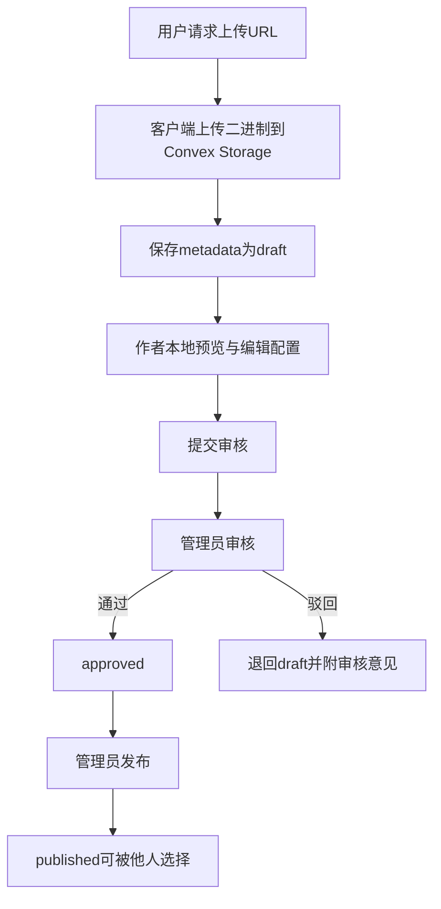

# 第二阶段：用户资源库 - 执行方案

## 1. 概述
- 目标
  - 建立面向登录用户的 sprite sheet 资源库，支持上传、配置、管理、审核、发布，并在编辑器内选用。
  - 中期阶段覆盖三类资源：瓦片集、角色动画、场景动画。
  - 编辑器保持兼容现有本地资源机制，同时补充用户上传资源入口，避免一次性替换 [`initTilesetLoader()`](AstrTown/src/editor/lehtmlui.js:282)、[`initSpriteSheetLoader()`](AstrTown/src/editor/lehtmlui.js:70) 和 [`registerSpritesheetResource()`](AstrTown/src/editor/le.js:2788)。
- 范围
  - 接入 Convex File Storage 上传链路。
  - 新增三类资源 metadata 表与审核状态字段。
  - 新增资源上传、列表管理、预览、删除、审核发布 API。
  - 新增资源上传页与编辑器资源选择器。
  - 将用户已发布资源纳入编辑器可选资源源，同时允许作者在本地编辑器上下文使用自己未发布的 sprite sheet 进行预览。
- 前置条件
  - 现有用户登录体系继续沿用 [`users`](AstrTown/convex/schema.ts) 与 [`sessions`](AstrTown/convex/schema.ts) 表。
  - 编辑器当前仍以本地静态资源为主：tileset 从 [`./tilesets/...`](AstrTown/src/editor/lehtmlui.js:289) 读取，场景动画通过 [`g_ctx.tileset.addTileSheet()`](AstrTown/src/editor/lehtmlui.js:81) 与 [`registerSpritesheetResource()`](AstrTown/src/editor/le.js:2788) 注入，角色动画依赖 [`AstrTown/data/characters.ts`](AstrTown/data/characters.ts) 和 [`AstrTown/data/spritesheets/types.ts`](AstrTown/data/spritesheets/types.ts) 的静态配置。
  - 短期阶段需要先确认：前端中可复用的登录态获取方式、管理后台入口位置、以及 Convex deploy 环境已允许使用 storage。

## 2. 数据模型设计

### 2.1 设计原则
- 资源类型必须拆表，不用单表硬塞不同切割结构，避免字段大量空置。
- 三张资源表共享统一审核字段、归属字段、文件字段与展示字段，方便前端管理列表聚合。
- 上传文件和业务 metadata 分离：文件先进入 Convex storage，再由 mutation 写 metadata。
- 预览与编辑使用 `draft`、`submitted`、`approved`、`published` 四阶段；实际对公众可见仅认 `published`。
- 为后续扩展做最小统一抽象：保留 `kind`、`ownerUserId`、`coverImageStorageId`、`version`、`publishedAt` 等公共字段。

### 2.2 状态模型
- `draft`
  - 用户上传完成但尚未提交审核，可反复编辑配置。
  - 仅作者可见。
- `submitted`
  - 用户主动提交审核后进入待审。
  - 作者可查看，不可再编辑核心配置，除非退回。
- `approved`
  - 审核通过但未正式发布，用于审核结果确认与批量发布预留。
  - 仅管理员和作者可见。
- `published`
  - 已发布，可被其他用户在资源库与编辑器中选择。
- 建议额外记录 `reviewDecision` 字段，枚举 `pending`、`approved`、`rejected`，避免仅靠 `status` 推断退回原因。

### 2.3 公共字段约定
三张表均包含以下字段：
- `kind`: 固定字面量，分别为 `tileset`、`character_sheet`、`scene_animation`
- `ownerUserId`: [`users`](AstrTown/convex/schema.ts) 表 id
- `title`: 资源名称
- `description`: 资源说明
- `tags`: 字符串数组
- `imageStorageId`: 原图文件 storageId
- `imageMimeType`: 文件类型
- `imageSizeBytes`: 文件大小
- `imageWidth`: 原图宽度
- `imageHeight`: 原图高度
- `coverImageStorageId`: 可选，预生成预览图 storageId，中期可先等于 `imageStorageId`
- `status`: `draft | submitted | approved | published`
- `reviewDecision`: `pending | approved | rejected`
- `submittedBy`: 提交人 userId，可选
- `submittedAt`: 提交时间，可选
- `reviewedBy`: 审核人 userId，可选
- `reviewedAt`: 审核时间，可选
- `reviewComment`: 审核意见，可选
- `publishedAt`: 发布时间，可选
- `version`: 整数，初始 1
- `createdAt`、`updatedAt`: 时间戳
- `deletedAt`: 软删除时间，可选

### 2.4 瓦片集资源表
#### 表名
- `tilesetAssets`

#### 字段
- 公共字段全部保留
- `sliceMode`: `grid`，中期先只支持规则网格
- `tileWidth`: 单瓦片宽度
- `tileHeight`: 单瓦片高度
- `padding`: 边距
- `spacing`: 瓦片间距，建议补充，避免后期再改 schema
- `margin`: 外边距，若与 `padding` 语义重合则二选一，推荐保留 `margin`，`padding` 用于兼容用户要求字段
- `columns`: 自动计算并落库，便于前端直接渲染索引
- `rows`: 自动计算并落库
- `tileCount`: 自动计算并落库
- `previewTileIndexes`: 预览用 tile index 数组，可选
- `editorCompatibility`: 对接现有编辑器所需参数对象，包含 `sourceWidth`、`sourceHeight`

#### 索引建议
- `by_owner_status`: `ownerUserId`, `status`
- `by_status_createdAt`: `status`, `createdAt`
- `by_kind_owner_updatedAt`: `kind`, `ownerUserId`, `updatedAt`

### 2.5 角色动画资源表
#### 表名
- `characterSheetAssets`

#### 字段
- 公共字段全部保留
- `frameDefs`: 帧定义数组，元素包含 `name`、`x`、`y`、`w`、`h`、`anchorX`、`anchorY`、`duration`
- `animations`: 动画映射对象，结构为 `animationName => frameRef[]`
- `directionMap`: 方向映射对象，结构为 `up/down/left/right => animationName`
- `defaultAnimation`: 默认动画名
- `defaultDirection`: 默认方向
- `frameSourceType`: `json_upload | inline_editor`
- `metadataStorageId`: 可选，用户上传原始 JSON 文件时保存 storageId
- `frameCount`: 自动计算
- `animationNames`: 冗余数组，便于列表筛选
- `canvasWidth`、`canvasHeight`: 用于前端校验

#### 兼容性说明
- 现有角色资源偏静态模块导入，短期不要直接改写 [`AstrTown/data/characters.ts`](AstrTown/data/characters.ts) 结构。
- 中期采用“运行时适配层”，将用户资源映射为与 [`data/spritesheets/types.ts`](AstrTown/data/spritesheets/types.ts) 相近的消费结构，再注入角色渲染链路。

### 2.6 场景动画资源表
#### 表名
- `sceneAnimationAssets`

#### 字段
- 公共字段全部保留
- `spritesheetJson`: 解析后的 spritesheet JSON 对象
- `metadataStorageId`: 原始 json 文件 storageId，可选
- `defaultSpeed`: 默认播放速度
- `loop`: 默认是否循环
- `animationNames`: 动画名称数组
- `frameCount`: 帧数
- `frameSourceType`: `json_upload | inline_editor`
- `defaultAnimation`: 默认动画名

#### 兼容性说明
- 该表需尽量贴近编辑器当前 [`registerSpritesheetResource()`](AstrTown/src/editor/le.js:2788) 接收的数据结构，降低接入成本。

### 2.7 建议的 schema 文件落点
- 在 [`AstrTown/convex/schema.ts`](AstrTown/convex/schema.ts) 中新增三张表定义和索引。
- 若 schema 变长明显，建议拆到 [`AstrTown/convex/assets/schema.ts`](AstrTown/convex/assets/schema.ts) 导出字段对象，再在主 schema 汇总引用。
- API 层建议按领域拆分：
  - `AstrTown/convex/assets/upload.ts`
  - `AstrTown/convex/assets/tilesets.ts`
  - `AstrTown/convex/assets/characterSheets.ts`
  - `AstrTown/convex/assets/sceneAnimations.ts`
  - `AstrTown/convex/assets/review.ts`
  - `AstrTown/convex/assets/queries.ts`

## 3. API设计

### 3.1 文件上传相关

#### `assets.generateUploadUrl`
- 类型：mutation
- 目标
  - 生成短时上传 URL，供客户端直接向 Convex File Storage POST 二进制。
- 入参
  - `kind`
  - `filename`
  - `mimeType`
  - `fileSizeBytes`
- 权限
  - 仅登录用户。
- 返回
  - `uploadUrl`
  - `expiresAt`
  - `uploadToken` 可选，用于第二步 metadata 落库防串改。
- 实现要点
  - 调用 `ctx.storage.generateUploadUrl()`。
  - 在 mutation 中校验资源类型与 mime 白名单。

#### `assets.saveAssetMetadata`
- 类型：mutation
- 目标
  - 文件上传成功后，将 `storageId` 与业务 metadata 写入对应资源表。
- 入参
  - `kind`
  - `storageId`
  - `title`
  - `description`
  - `tags`
  - `config` 按资源类型区分
- 权限
  - 仅上传者本人。
- 返回
  - `assetId`
  - `status`
- 技术要点
  - 根据 `kind` 分派写入 `tilesetAssets`、`characterSheetAssets`、`sceneAnimationAssets`。
  - 自动补齐 `ownerUserId`、`createdAt`、`updatedAt`、`status = draft`。
  - 存前对图片尺寸、tile 切割参数、JSON 结构做服务端校验。

### 3.2 资源管理相关

#### `assets.listAssets`
- 类型：query
- 目标
  - 为资源管理页和资源选择器提供分页列表。
- 入参
  - `kind?`
  - `status?`
  - `ownerScope`: `mine | published | review_queue`
  - `search?`
  - `cursor?`
  - `limit`
- 权限
  - `mine` 仅登录用户本人。
  - `review_queue` 仅管理员。
  - `published` 公开可见，未登录也可用视项目决定；中期建议登录后调用即可。
- 返回
  - 统一列表项：`assetId`、`kind`、`title`、`status`、`thumbnailUrl`、`updatedAt`、`ownerSummary`、`configSummary`
- 技术要点
  - 中期允许服务端做三表聚合后统一排序；若 Convex 聚合复杂，可前端按 kind 分三次查再合并，但优先规划统一 query。

#### `assets.getAssetDetail`
- 类型：query
- 目标
  - 返回单个资源详情，用于预览和配置回填。
- 入参
  - `kind`
  - `assetId`
- 返回
  - 公共字段 + 类型专属配置 + 可访问 URL

#### `assets.getAssetFileUrl`
- 类型：query
- 目标
  - 根据 `storageId` 获取访问 URL。
- 入参
  - `storageId`
- 返回
  - `url`
- 技术要点
  - 调用 `ctx.storage.getUrl(storageId)`。
  - 对未发布资源增加作者或管理员权限校验。

#### `assets.deleteAsset`
- 类型：mutation
- 目标
  - 作者删除自己的草稿资源，管理员可删除违规资源。
- 入参
  - `kind`
  - `assetId`
- 返回
  - `success`
- 技术要点
  - 中期建议先软删除：写 `deletedAt`，并可选调用 storage delete 清理孤儿文件。
  - `published` 资源删除需管理员权限或先下架后删除。

#### `assets.submitAssetForReview`
- 类型：mutation
- 目标
  - 用户将草稿提交审核。
- 入参
  - `kind`
  - `assetId`
- 返回
  - `status = submitted`

### 3.3 审核流程相关

#### `assets.reviewAsset`
- 类型：mutation
- 目标
  - 管理员审核通过或驳回。
- 入参
  - `kind`
  - `assetId`
  - `decision`: `approve | reject`
  - `comment`
- 返回
  - 新状态
- 状态迁移
  - `submitted -> approved`
  - `submitted -> draft` 同时 `reviewDecision = rejected`

#### `assets.publishAsset`
- 类型：mutation
- 目标
  - 管理员将 `approved` 资源发布。
- 入参
  - `kind`
  - `assetId`
- 返回
  - `status = published`
- 说明
  - 若业务允许审核通过即发布，也可将 `reviewAsset` 合并 `publishNow` 参数；但中期建议拆开，保留更清晰流程。

#### 推荐流程图

## 4. 任务清单

| 任务ID | 任务名称 | 优先级 | 依赖 | 预估复杂度 |
|--------|----------|--------|------|------------|
| M.1 | 接入 Convex File Storage 与资源领域基础模块 | 高 | 无 | 高 |
| M.2 | 新增三类资源表与统一审核状态模型 | 高 | M.1 | 高 |
| M.3 | 实现资源上传与 metadata 保存 API | 高 | M.1, M.2 | 高 |
| M.4 | 实现资源列表、详情、访问 URL、删除接口 | 高 | M.2, M.3 | 中 |
| M.5 | 实现资源审核与发布流程接口 | 高 | M.2, M.4 | 中 |
| M.6 | 实现资源上传页与类型化配置表单 | 高 | M.3 | 高 |
| M.7 | 实现资源管理页与审核工作台 | 中 | M.4, M.5 | 中 |
| M.8 | 实现编辑器资源选择器与资源预览缓存 | 高 | M.4, M.6 | 高 |
| M.9 | 集成用户瓦片集到地图编辑器 | 高 | M.8 | 高 |
| M.10 | 集成用户场景动画到编辑器注册链路 | 高 | M.8 | 高 |
| M.11 | 集成用户角色动画到角色渲染配置层 | 中 | M.8 | 高 |
| M.12 | 补充验收用例与联调清单 | 中 | M.6, M.7, M.8, M.9, M.10, M.11 | 中 |

## 5. 详细任务说明

### 任务 M.1：接入 Convex File Storage 与资源领域基础模块
**目标**：建立上传文件到 Convex Storage 的最小基础设施，并预留资源领域目录结构，避免后续上传、查询、审核逻辑散落在多个现有文件中。

**修改文件**：
- [`AstrTown/convex/schema.ts`](AstrTown/convex/schema.ts) - 预留资源表接入口
- [`AstrTown/convex/http.ts`](AstrTown/convex/http.ts) - 仅在需要 HTTP 辅助端点时扩展，否则保持不动
- `AstrTown/convex/assets/_shared.ts` - 新增，放共享校验、权限、类型定义
- `AstrTown/convex/assets/upload.ts` - 新增，封装上传 URL 与 storage 工具

**实施步骤**：
1. 在 `convex/assets` 目录创建共享模块，抽取资源类型枚举、状态枚举、通用权限检查函数。
2. 在上传模块中新增 `generateUploadUrl` mutation，按现有 Convex function 风格组织导出。
3. 封装获取当前登录用户的方法，复用现有登录态逻辑，不新造鉴权体系。
4. 约定文件白名单：图片仅允许 png，metadata 可允许 json。
5. 定义后续表写入所需的通用 payload 类型。

**技术要点**：
- 优先使用 Convex mutation 而非自建 [`httpRouter`](AstrTown/convex/http.ts:30) 上传接口，因为官方推荐链路更适合直传。
- 上传 URL 只负责授权，不在此阶段写业务表。
- 将资源能力收敛到 `convex/assets` 子目录，降低对既有模块的侵入。

**验收标准**：
- [ ] 已存在生成上传 URL 的 mutation，登录用户可调用
- [ ] 非法 kind 或 mimeType 会被拒绝
- [ ] 上传领域共享枚举和权限函数已沉淀到独立模块

### 任务 M.2：新增三类资源表与统一审核状态模型
**目标**：在 Convex schema 中落地 `tilesetAssets`、`characterSheetAssets`、`sceneAnimationAssets`，并统一审核流字段与查询索引。

**修改文件**：
- [`AstrTown/convex/schema.ts`](AstrTown/convex/schema.ts) - 新增三张表和索引
- `AstrTown/convex/assets/schema.ts` - 新增，共享字段定义

**实施步骤**：
1. 提取公共字段对象，如归属、审核、时间戳、文件信息。
2. 为三类资源补充专属字段定义。
3. 在主 schema 中注册三张表并配置 owner、status、createdAt 相关索引。
4. 对角色和场景动画中的 JSON 字段选择 Convex 可接受的 `v.any` 或明确对象结构，优先确保可校验与可演进。
5. 输出统一文档类型供前端与 API 层引用。

**技术要点**：
- 角色动画和场景动画的 JSON 结构变化较大，中期可用 `v.any()` 包装解析后对象，但必须在 mutation 内做严格运行时校验。
- `kind` 虽为固定字段，仍建议保留，便于三表聚合列表和通用前端组件渲染。

**验收标准**：
- [ ] 三张资源表已在 schema 中定义
- [ ] 每张表都具备 owner、status、review、time 索引
- [ ] 字段足以表达用户要求中的配置项与审核流

### 任务 M.3：实现资源上传与 metadata 保存 API
**目标**：完成从客户端获取上传 URL、上传文件、保存 metadata 的两阶段提交流程。

**修改文件**：
- `AstrTown/convex/assets/upload.ts` - 新增上传 API
- `AstrTown/convex/assets/tilesets.ts` - 新增 tileset metadata 保存逻辑
- `AstrTown/convex/assets/characterSheets.ts` - 新增角色资源保存逻辑
- `AstrTown/convex/assets/sceneAnimations.ts` - 新增场景动画保存逻辑
- `AstrTown/convex/_generated/api.d.ts` - 自动生成

**实施步骤**：
1. 为三类资源分别实现 `createDraft...` mutation，或由统一 `saveAssetMetadata` 内部分派。
2. 服务端读取客户端传入的图片尺寸和配置，交叉校验是否合法。
3. tileset 自动计算 `rows`、`columns`、`tileCount`。
4. 角色动画与场景动画对 JSON metadata 做结构校验和归一化。
5. 保存完成后返回资源 id 与当前状态。

**技术要点**：
- 配置校验必须在服务端执行，前端校验仅作交互优化。
- 资源保存与审核状态初始化统一为 `draft`。
- 若用户重复上传同一原图，可先不做去重，中期只保证流程稳定。

**验收标准**：
- [ ] 客户端能按官方三步流程完成上传并拿到资源 id
- [ ] 三类资源都可保存 metadata
- [ ] 非法 JSON、非法切片参数会被明确拒绝

### 任务 M.4：实现资源列表、详情、访问 URL、删除接口
**目标**：为资源管理页和编辑器资源选择器提供统一的数据查询与删除能力。

**修改文件**：
- `AstrTown/convex/assets/queries.ts` - 新增列表、详情、URL 查询
- `AstrTown/convex/assets/delete.ts` - 新增删除逻辑

**实施步骤**：
1. 实现统一 `listAssets` query，支持按 kind、status、scope 查询。
2. 实现 `getAssetDetail` query，返回类型专属配置和可访问图片 URL。
3. 实现 `getAssetFileUrl` query，封装 storage URL 获取。
4. 实现 `deleteAsset` mutation，先软删除并做权限控制。
5. 对外暴露统一列表项 DTO，减少前端判断分支。

**技术要点**：
- 未发布资源 URL 不应对非作者开放。
- 中期可以不做全文检索，搜索先用 title 前缀或包含匹配实现。
- 删除操作必须阻止普通作者直接删已发布资源。

**验收标准**：
- [ ] 作者可看到自己的 draft、submitted、approved、published 资源
- [ ] 普通用户只能看到 published 资源
- [ ] 未授权用户无法获取未发布资源 URL
- [ ] 删除后资源不再出现在列表中

### 任务 M.5：实现资源审核与发布流程接口
**目标**：为管理员提供审核、驳回、发布能力，形成完整资源生命周期。

**修改文件**：
- `AstrTown/convex/assets/review.ts` - 新增审核与发布 mutation
- `AstrTown/convex/assets/_shared.ts` - 补充管理员权限判断

**实施步骤**：
1. 新增 `submitAssetForReview` mutation，由作者调用。
2. 新增 `reviewAsset` mutation，管理员执行通过或驳回。
3. 新增 `publishAsset` mutation，将 `approved` 资源发布。
4. 统一封装状态迁移校验，防止非法跃迁。
5. 记录 `submittedBy`、`reviewedBy`、`reviewComment`、`publishedAt`。

**技术要点**：
- 驳回建议回到 `draft`，便于作者继续编辑后再次提交。
- 发布与审核拆开，可避免审核时误公开资源。
- 审核日志中期先放当前表字段，不单独建审计表。

**验收标准**：
- [ ] 作者只能提交自己的 draft 资源
- [ ] 管理员可审核 submitted 资源
- [ ] 仅 approved 资源可发布
- [ ] 所有状态迁移均有权限和前置状态校验

### 任务 M.6：实现资源上传页与类型化配置表单
**目标**：提供可用的上传与配置 UI，让用户能够完成图片上传、参数配置、预览、保存草稿。

**修改文件**：
- `AstrTown/src/components/assets/AssetUploadPage.tsx` - 新增上传页
- `AstrTown/src/components/assets/AssetTypeTabs.tsx` - 新增类型切换
- `AstrTown/src/components/assets/AssetDropzone.tsx` - 新增拖拽上传
- `AstrTown/src/components/assets/TilesetConfigForm.tsx` - 新增瓦片集配置表单
- `AstrTown/src/components/assets/CharacterSheetConfigForm.tsx` - 新增角色动画配置表单
- `AstrTown/src/components/assets/SceneAnimationConfigForm.tsx` - 新增场景动画配置表单
- `AstrTown/src/hooks/assets/useAssetUpload.ts` - 新增上传流程 hook

**实施步骤**：
1. 新建资源上传页，选择资源类型后展示对应表单。
2. 拖拽区支持选择 png 和 json 文件，并在本地显示预览。
3. 瓦片集表单输入 `tileWidth`、`tileHeight`、`padding`、`spacing` 后即时计算切片预览。
4. 角色动画表单支持上传 JSON 或在线编辑 `frameDefs`、`animations`。
5. 场景动画表单支持上传 spritesheet json，展示动画名与帧数。
6. 点击保存时调用上传 URL + 文件直传 + metadata 保存流程。

**技术要点**：
- 预览逻辑尽量在前端本地完成，减少无效上传。
- 配置表单拆组件，不要把三类资源逻辑堆进一个大组件。
- JSON 编辑器中期可先用 textarea + schema 校验，不强依赖大型编辑器库。

**验收标准**：
- [ ] 用户可拖拽上传 PNG 并看到预览
- [ ] 三类资源都有独立配置表单
- [ ] 保存草稿后能回到详情或管理列表查看结果

### 任务 M.7：实现资源管理页与审核工作台
**目标**：提供资源列表、搜索、过滤、预览、删除与审核处理界面。

**修改文件**：
- `AstrTown/src/components/assets/AssetManagerPage.tsx` - 新增管理页
- `AstrTown/src/components/assets/AssetList.tsx` - 新增列表组件
- `AstrTown/src/components/assets/AssetCard.tsx` - 新增卡片预览
- `AstrTown/src/components/assets/AssetFilters.tsx` - 新增过滤器
- `AstrTown/src/components/assets/ReviewQueuePage.tsx` - 新增审核工作台

**实施步骤**：
1. 实现我的资源列表，支持 kind、status、关键词过滤。
2. 卡片项显示缩略图、状态、更新时间、操作按钮。
3. 详情弹层中展示切片配置、动画定义摘要、审核意见。
4. 管理员审核页按 `submitted` 状态拉取待审核资源。
5. 审核页支持预览、通过、驳回、发布。

**技术要点**：
- 列表查询 DTO 统一，渲染层仅按 kind 分支显示摘要信息。
- 管理页与审核页尽量共用卡片和详情组件。

**验收标准**：
- [ ] 作者可管理自己的资源
- [ ] 管理员可看到 submitted 队列
- [ ] 删除、提交审核、驳回、发布操作链路完整

### 任务 M.8：实现编辑器资源选择器与资源预览缓存
**目标**：在编辑器中新增用户资源选择入口，允许切换本地资源与用户资源，并对远程资源进行缓存与预览。

**修改文件**：
- [`AstrTown/src/editor/lehtmlui.js`](AstrTown/src/editor/lehtmlui.js) - 新增资源来源 UI 与选择逻辑
- [`AstrTown/src/editor/le.html`](AstrTown/src/editor/le.html) - 增加资源选择入口
- `AstrTown/src/editor/assetPickerBridge.js` - 新增，封装编辑器与前端资源库桥接
- `AstrTown/src/hooks/assets/useEditorAssetPicker.ts` - 新增，负责调用资源列表 API

**实施步骤**：
1. 在编辑器 UI 中新增“本地资源 / 用户资源”切换。
2. 当选择用户资源时，弹出资源选择器，拉取 `published` 资源；若当前用户是作者，可额外看到自己的未发布资源。
3. 选择资源后，将远程图片 URL 和 metadata 转成编辑器可消费的本地结构。
4. 建立内存缓存：以 `assetId + version` 为 key 缓存已加载的纹理与配置。
5. 当缓存命中时直接复用，减少重复请求和重复纹理解析。

**技术要点**：
- 不直接推翻 [`initTilesetLoader()`](AstrTown/src/editor/lehtmlui.js:282) 和 [`initSpriteSheetLoader()`](AstrTown/src/editor/lehtmlui.js:70)，而是新增补充入口，保留本地文件加载能力。
- 编辑器使用原生 JS，资源库页面多半是 React，建议通过桥接层隔离调用。
- 作者可使用自己本地未发布 sprite sheet 资源，应理解为作者在其编辑器上下文中可见自己的 draft 和 submitted 资源，而非浏览器本地文件系统直连替代 storage。

**验收标准**：
- [ ] 编辑器内可切换选择本地资源或用户资源
- [ ] 已选用户资源可在当前会话内复用缓存
- [ ] 非作者无法在选择器中看到未发布资源

### 任务 M.9：集成用户瓦片集到地图编辑器
**目标**：让用户上传的瓦片集可进入地图编辑器现有 tileset 使用链路。

**修改文件**：
- [`AstrTown/src/editor/lehtmlui.js`](AstrTown/src/editor/lehtmlui.js) - 接入用户 tileset 选择结果
- [`AstrTown/src/editor/le.js`](AstrTown/src/editor/le.js) - 接入远程 tileset 注册与切片参数
- [`AstrTown/src/editor/mapfile.js`](AstrTown/src/editor/mapfile.js) - 仅在保存地图时如需记录资源引用则扩展

**实施步骤**：
1. 将 `tilesetAssets` 返回的图片 URL 与切片配置映射为编辑器现有 tileset 初始化参数。
2. 在切换用户瓦片集时刷新当前选块面板与地图纹理源。
3. 若地图文件需要持久保存用户资源引用，增加 `assetRef` 结构，包含 `kind`、`assetId`、`version`。
4. 保证现有本地 tileset 地图仍可正常打开。

**技术要点**：
- 需要兼容 [`g_ctx.tilesetpath`](AstrTown/src/editor/lehtmlui.js:289) 当前使用字符串路径的模式，建议新增 `g_ctx.tilesetSource` 结构，而不是只靠 path。
- 用户资源地图保存时不能只记 URL，应记录稳定 asset 引用。

**验收标准**：
- [ ] 用户瓦片集可在编辑器中显示并被选中绘制
- [ ] 本地 tileset 功能不回归
- [ ] 地图保存结构若引用用户资源，能稳定回放

### 任务 M.10：集成用户场景动画到编辑器注册链路
**目标**：让用户上传的场景动画 spritesheet 可复用现有注册逻辑进入地图与场景编辑流程。

**修改文件**：
- [`AstrTown/src/editor/lehtmlui.js`](AstrTown/src/editor/lehtmlui.js) - 资源选择回调
- [`AstrTown/src/editor/le.js`](AstrTown/src/editor/le.js) - 扩展场景动画资源注册
- [`AstrTown/src/editor/spritefile.js`](AstrTown/src/editor/spritefile.js) - 如涉及序列化资源引用则扩展

**实施步骤**：
1. 将 `sceneAnimationAssets.spritesheetJson` 归一化为当前注册函数可接受结构。
2. 选择资源后调用现有注册入口或新增包装函数进行注册。
3. 在场景动画选择 UI 中展示动画名、默认速度、循环方式。
4. 保存场景对象时记录 `assetId + animationName`，而不是只记临时文件名。

**技术要点**：
- 优先兼容 [`registerSpritesheetResource()`](AstrTown/src/editor/le.js:2788) 现有输入形态，避免大改下游渲染。
- 远程资源注册后要确保 `g_ctx.refreshSceneAnimationUI()` 仍可刷新预览。

**验收标准**：
- [ ] 用户上传的场景动画可在编辑器预览并放置
- [ ] 保存后重新加载仍能找到对应资源
- [ ] 现有内置场景动画不受影响

### 任务 M.11：集成用户角色动画到角色渲染配置层
**目标**：在不破坏静态角色资源体系的前提下，引入用户上传角色动画资源的运行时选择能力。

**修改文件**：
- [`AstrTown/data/characters.ts`](AstrTown/data/characters.ts) - 仅在需要引入动态资源适配点时轻量扩展
- [`AstrTown/src/components/Character.tsx`](AstrTown/src/components/Character.tsx) - 支持运行时资源来源
- `AstrTown/src/lib/assets/characterAssetAdapter.ts` - 新增，将用户 metadata 适配为角色渲染配置
- 可能新增 `AstrTown/src/hooks/assets/useCharacterAsset.ts`

**实施步骤**：
1. 梳理 [`Character.tsx`](AstrTown/src/components/Character.tsx) 当前消费的角色资源结构。
2. 新增适配器，将 `characterSheetAssets` 转换成与静态 spritesheet 模块一致或近似的数据结构。
3. 在角色渲染层支持 `staticAssetKey` 与 `userAssetRef` 两种来源。
4. 保持已有角色配置不变，仅在发现 `userAssetRef` 时走动态 URL + metadata 渲染分支。

**技术要点**：
- 这是中期最容易牵一发动全身的点，必须通过适配器层隔离动态资源与静态配置差异。
- 不建议直接把用户资源写进 [`AstrTown/data/characters.ts`](AstrTown/data/characters.ts) 静态文件。

**验收标准**：
- [ ] 动态角色资源可被渲染组件识别
- [ ] 现有静态角色资源表现不变
- [ ] 角色方向映射和默认动画配置可用

### 任务 M.12：补充验收用例与联调清单
**目标**：为后续实现模式提供分阶段验证基线，保证每个任务可独立测试、整体可联调。

**修改文件**：
- `plans/用户资源库方案.md` - 补充联调与验收矩阵
- 如用户允许，再补充测试文档文件

**实施步骤**：
1. 为三类资源分别列出上传、保存、列表、预览、审核、发布、编辑器接入验收路径。
2. 明确权限测试矩阵：作者、管理员、普通登录用户。
3. 明确兼容性回归点：本地 tileset、本地场景动画、静态角色资源。
4. 输出联调顺序，建议先 tileset，再 scene animation，最后 character。

**技术要点**：
- 当前用户要求的是执行方案，因此这里只输出可执行清单，不额外编写测试脚本。

**验收标准**：
- [ ] 方案中包含每类资源的独立验收路径
- [ ] 包含角色与权限的回归检查项
- [ ] 可直接交由实现模式逐项执行

## 6. 前端组件设计

### 6.1 组件分层
- 页面层
  - `AssetUploadPage`
  - `AssetManagerPage`
  - `ReviewQueuePage`
- 领域组件层
  - `AssetDropzone`
  - `AssetPreviewPanel`
  - `AssetList`
  - `AssetCard`
  - `AssetPickerModal`
- 表单层
  - `TilesetConfigForm`
  - `CharacterSheetConfigForm`
  - `SceneAnimationConfigForm`
- Hook 层
  - `useAssetUpload`
  - `useAssetList`
  - `useAssetReview`
  - `useEditorAssetPicker`

### 6.2 资源上传组件
- 能力
  - 拖拽上传 png
  - 预览图片尺寸
  - 根据类型显示不同配置表单
  - 上传 json metadata 并即时校验
- 交互流程
  1. 选择资源类型
  2. 选择 png 文件
  3. 若需要，上传或编辑 json metadata
  4. 展示切片或动画预览
  5. 保存草稿
  6. 可选提交审核

### 6.3 资源管理组件
- 能力
  - 我的资源列表
  - 搜索标题
  - 过滤 kind、status
  - 卡片预览
  - 删除、提交审核、查看审核意见
- 列表项建议字段
  - 缩略图
  - 标题
  - 类型
  - 状态
  - 更新时间
  - 动画数或 tile 数摘要

### 6.4 资源选择器
- 使用场景
  - 地图编辑器选择瓦片集
  - 编辑器选择场景动画资源
  - 角色配置界面选择角色动画资源
- 数据来源
  - 默认显示 `published`
  - 若当前用户为作者，则额外显示本人未发布资源
- 推荐交互
  - 左侧过滤器，右侧卡片列表，下方详情预览
  - 选中后返回 `assetRef`
    - `kind`
    - `assetId`
    - `version`
    - `resolvedUrl`
    - `config`

### 6.5 瓦片集配置表单
- 输入项
  - `tileWidth`
  - `tileHeight`
  - `padding`
  - `spacing`
- 本地预览
  - 实时叠加网格
  - 显示总 tile 数
  - 点击格子展示 index

### 6.6 角色动画配置表单
- 两种模式
  - 上传 JSON metadata
  - 在线编辑 `frameDefs` 和 `animations`
- 预览能力
  - 选择动画名播放
  - 选择方向预览 directionMap
- 校验项
  - 每帧坐标不得越界
  - 动画引用的帧必须存在
  - 默认动画和默认方向必须有效

### 6.7 场景动画配置表单
- 输入项
  - spritesheet JSON
  - `defaultSpeed`
  - `loop`
  - `defaultAnimation`
- 预览能力
  - 下拉切换动画名
  - 播放速度控制

## 7. 与编辑器的集成方案

### 7.1 集成原则
- 不替换现有本地文件加载机制，只补充用户资源入口。
- 通过桥接层把远程资源映射为编辑器现有结构，避免大改 [`le.js`](AstrTown/src/editor/le.js) 和 [`lehtmlui.js`](AstrTown/src/editor/lehtmlui.js)。
- 编辑器内部始终消费统一 `assetRef` 或规范化资源对象，而不是直接耦合 Convex query 返回。

### 7.2 瓦片集集成
- 当前入口
  - [`initTilesetLoader()`](AstrTown/src/editor/lehtmlui.js:282)
- 方案
  - 保留本地 `input[type=file]`。
  - 新增用户资源按钮，弹出资源选择器。
  - 选择后返回图片 URL 与切片配置，更新 `g_ctx` 中的 tileset source。
  - 若地图保存文件支持资源引用，则新增 `assetRef` 字段。

### 7.3 场景动画集成
- 当前入口
  - [`initSpriteSheetLoader()`](AstrTown/src/editor/lehtmlui.js:70)
  - [`g_ctx.tileset.addTileSheet()`](AstrTown/src/editor/lehtmlui.js:81)
  - [`registerSpritesheetResource()`](AstrTown/src/editor/le.js:2788)
- 方案
  - 用户资源选择器返回 `sceneAnimationAssets` 详情。
  - 通过桥接层将其转为现有注册函数使用的 `sheetName + sheetJson + texture` 组合。
  - 注册完成后继续调用现有刷新方法。

### 7.4 角色动画集成
- 当前入口
  - [`AstrTown/data/characters.ts`](AstrTown/data/characters.ts)
  - [`AstrTown/src/components/Character.tsx`](AstrTown/src/components/Character.tsx)
- 方案
  - 不动原静态角色定义，只增加 `userAssetRef` 支持。
  - 角色渲染时若检测到 `userAssetRef`，则从资源库查询 metadata 与 URL，走动态适配器。

### 7.5 资源缓存策略
- 缓存层级
  - 内存缓存：当前会话纹理对象与 metadata
  - 浏览器缓存：依赖 storage URL 响应头
- 缓存 key
  - `kind:assetId:version`
- 失效策略
  - 当资源重新保存生成新 version 时，key 自动变化
  - 用户手动刷新资源列表时可清空内存缓存
- 注意点
  - 不建议把完整大图 base64 写入地图文件
  - 地图与场景文件只保存稳定 `assetRef`

## 8. 风险与注意事项
- 角色资源动态化风险最高，必须通过适配器层隔离，避免直接侵入静态导入体系。
- Convex schema 若把复杂 JSON 写得过死，后续动画字段演化成本高；若全用 `v.any()`，又会失去类型约束。中期建议 schema 放宽、mutation 严校验。
- 编辑器当前大量逻辑是原生 JS 全局上下文 `g_ctx` 驱动，接入 React 资源页时要通过桥接层处理，避免双向耦合。
- storage URL 可能是临时 URL，编辑器保存配置时不能只存 URL，必须保存 `assetId + version`。
- 删除已发布资源涉及引用回放风险，建议先做软删除和下架，不直接物理清理。
- 资源审核流程中，普通用户只能看到已发布资源；作者仅能在自己的编辑器上下文中预览自己未发布的 sprite sheet 资源，这一权限边界需要在 query 层明确实现。

## 9. 联调与验收顺序建议
1. 先打通 `tilesetAssets` 全链路，因为规则网格切片最稳定，最适合作为资源库基础样板。
2. 再接 `sceneAnimationAssets`，复用现有编辑器注册机制验证远程资源注入能力。
3. 最后接 `characterSheetAssets`，通过适配器方式完成动态角色资源消费。
4. 审核发布流在三类资源都能保存草稿后统一接入，减少前期阻塞。

## 10. 计划确认点
- 当前方案按以下业务边界设计：登录用户上传并管理自己的资源；管理员负责审核与发布；其他用户仅能看到已发布资源；作者可在自己的编辑器上下文中使用自己的未发布 sprite sheet 资源。
- 若后续要把 `approved` 合并为自动发布，或允许团队共享未发布资源，需要在 API 权限与状态机上同步调整。
